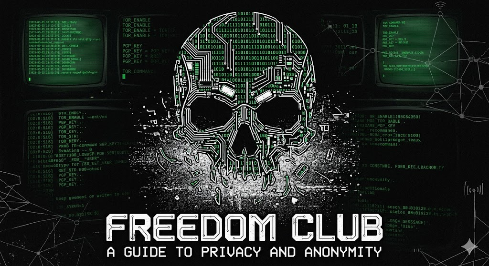
# ***Freedom Club***

# Introdução

Com o grande avanço da Tecnologia de Inteligência Artificial, e com o desenvolvimento tecnológico de governos e empresas, em métodos expiatórios e de coleta massiva de dados. É natural imaginar que tenham pessoas que queiram evitar isso, e por esse motivo crio este guia focado em lhe apresentar tecnologias e técnicas para auxiliar você nisso, Espero que seja de ajuda para que você comece a se proteger, ou apenas a ter mais privacidade.

> _nota: Sou apenas uma pessoa apaixonada por cybersegurança, e que gosta de ajudar e ensinar outras pessoas, esse guia ainda está imcompleto uma vez que segurança nunca é demais._

# POR QUE SER ANÔNIMO?
  
A maioria das pessoas ouve "anonimato" e pensa em hacker de capuz, ou em alguém fazendo algo ilegal na dark web.  
Mas pensa comigo:  
- Você fecha a porta do banheiro mesmo quando está sozinho em casa?  
- Você não fala sua senha do banco em voz alta no ônibus? Com certeza não.   
- Você não entrega seu diário para um estranho ler?  Também não.   

**Isso não é paranoia.**  
É um comportamento natural de quem entende que algumas coisas são suas, e só suas. 

Anonimato é exatamente isso, o direito de existir em algum espaço sem ser observado, catalogado e analisado.  
Você não precisa ter nada a esconder para querer privacidade. Você só precisa ser humano, é autopreservação.  

# Por que privacidade importa?

Existe um argumento que você vai ouvir muito:

_"Se você não tem nada a esconder, não tem nada a temer."_

Parece razoável. Mas é uma das frases mais sem sentido que existem.  
Traduzindo o que ela realmente diz: "abra mão dos seus direitos para provar que não é culpado de nada."  
Privacidade não é sobre esconder crimes. É sobre poder existir sem ser monitorado o tempo todo ou ter seus dados espalhados aos 4 ventos.

Pensa no que acontece com seus dados hoje:
- Cada site que você acessa vira um ponto num mapa sobre quem você é
- Cada compra que você faz alimenta um perfil de comportamento
- Cada busca que você faz revela suas dúvidas, medos e desejos
- **Esse perfil inteiro é vendido, vazado, ou entregue para governos**

E o problema não é só o presente. É que esses dados ficam guardados.  
O que é legal hoje pode não ser amanhã. O que você disse por brincadeira em 2019 pode ser usado contra você em 2030 (e várias pessoas já passaram por isso).  
Privacidade é o que garante que você tenha espaço para pensar, errar, mudar de ideia e se expressar, sem que cada passo seu seja registrado para sempre.  

> Vigilância em massa não precisa prender todo mundo para funcionar. Ela só precisa que as pessoas se comportem como se pudessem ser presas a qualquer momento.

Isso se chama efeito inibidor, e é exatamente o que acontece quando as pessoas sabem que estão sendo observadas. Elas param de questionar, Param de pesquisar, Param de falar (1984, ou qualquer governo autoritário).  
É aí quando a vigilância já ganhou. Sem precisar fazer nada.

É por isso que esse guia existe.
Não para te tornar invisível, afinal, como veremos asseguir, isso é impossível.
Mas para te dar ferramentas para dificultar ao máximo quem quer que esteja te observando sem sua permissão.

e para conseguir isso, vai precisar saber a base de tudo, a técnica que sustenta isso...

# OPSEC
  
Vamos começar pelo mais importante, não adianta de nada, ter o navegador mais seguro se você se apresenta assim:  

> olá, me chamo francisco e moro no maranhão, tenho 3 filhos, e sou separado da minha esposa.

Completamente errado.  
Já entrega **tudo** que seria necessário para lhe rastrear.  
Sei que atualmente é dificil não poder postar uma foto no instagram, para conseguir nossa dose de dopamina dos likes, mas infelizmente são escolhas, se você não precisa se expor, evite.

Opsec (Segurança operacional) é a base de tudo, pois possuindo um bom opsec, você poderá sempre se camuflar, ou ocultar coisas da sua vida. o ideal é deixar ela o menos exposta possivel  

## Opsec tem 5 etapas:
1. Identificação de informações críticas: definir o que você quer que ninguem saiba.
2. Análise de ameaças: Quem pode vazar ou lhe rastrear.
3. Análise de vulnerabilidades: Como isso pode vazar.
4. Avaliação de Risco: qual seria o impacto e Probalidade.
5. Aplicação de medidas: Contramedidas físicas e digitais. 

Para exemplificar vamos imaginar um cenário hipotético:
- Você tem seu instagram, mas não quer que ninguém saiba onde mora ou seu número de telefone.
- Um pedido das autoridades para localizar sua casa e seu número, ou um hacker querendo fazer chantagem em você.
- Pode haver um vazamento de dados por parte do instagram, ou eles cederem a pressão das autoridades
- Impacto Alto, mas probabilidade baixa, em questão do hacker, o impacto também é alto, mas a probabilidade seria média.
- Contramedidas cabíveis, não por seu endereço exato, usar número descartável, não ceder nada para a Meta.

esse seria um exemplo de uma ocorrência, mas pode ter varias, como vazamento de cpf, ou rg, ou você só não quer ter seus dados vigiados.
Depende muito.

#### Resumindo:
Opsec não é apenas um ato, é um estilo de vida onde é necessário viver de uma forma que não exponha seus dados. Infelizmente é o preço a ser pago

> Observação: _só avisando, única forma atual de ser 100% anônimo é ficando fora da internet, de resto só podemos dificultar e/ou diminuir o rastreamento._

# Sistemas Operacionais
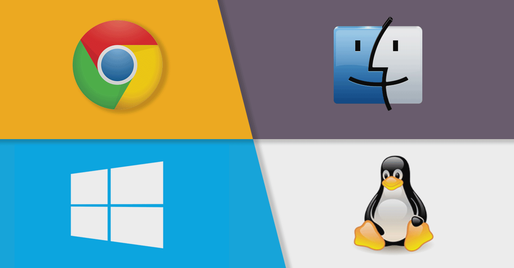
Agora que você sabe como e porque se manter seguro e com privacidade, vamos para o próximo tópico que mais pesa, seu sistema operacional.  
Sistema operacional é muito importante, pois do que adianta praticar toda a segurança do mundo e o seu sistema entregar seus dados?

Sistemas operacionais tem os de código fechado e de código aberto (open-source).
> _nota: código aberto significa que qualquer pessoa consegue ver o código, analisar e buscar por falhas._  

e por mais incrível que pareça, quanto mais aberto o código for, menos bugs ou problemas eles tem, pois como qualquer um consegue ver como funciona, os problemas são encontrados de maneira muito mais rápida e eficiente, diferente de códigos fechados que é mais dificil achar problemas, mas quando acha depende apenas da empresa dona para executar a correção.

com isso temos os 3 grandes SO (sistemas operacionais, irei abreviar):

- Windows
- Mac
- Linux

Vou passar por cada um dele e explicar como tornar mais privado ou apresentar um SO específico para privacidade.


## Windows
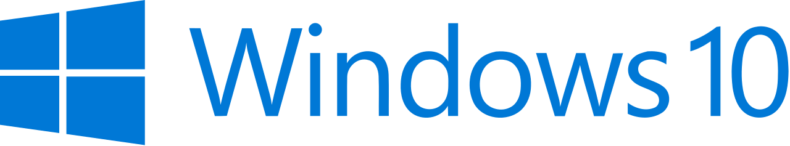
Com certeza o SO mais conhecido, e mais popular, mas não é por causa disso que é o mais privado (ou até melhor), como crescemos usando ele, acabamos acostumando e usando ele para tudo, então você fica acostumado e padrão com ele.

As caracteristicas deles (como se ninguem conhecesse):
- Interface Gráfica Baseada em Janelas
- Compatibilidade
    - a maior parte dos softwares são criados para windows.
- Recursos Modernos
- Ambiente de Arquivos

(tudo isso tem em todos os sistemas operacionais).

Agora os problemas dele:
(**Problemas concentrados no Windows 11**)
- Privacidade
    - telemetria (coleta nativa) 
        - sempre vai ta coletando e enviando dados seus para microsoft
    - Recurso Recall (IA)
        - o recurso Recall gerou polêmica ao tirar "prints" constantes da tela para que a IA ajude o usuário a encontrar atividades passadas.
- IA
    - além do recall já citado, tem diversos recursos de IA 
- Vazamentos
    - Exposição de Suporte (2020)
    - Invasão "Midnight Blizzard" (2024)
    - Vazamento do Microsoft 365 Copilot (2026)

A microsoft nunca foi uma empresa que se importa muito com o consumidor, ou com a sua privacidade.  
Como exemplo acabou com o Windos 10 por nada, para obrigar a utilização de Windows 11, que está cheio de bugs e problemas.  
Se quiser continuar usando ela o máximo que posso passar é uma ajuda de como diminuir a zona de risco.

### **COMO DESATIVAR IA E RECURSOS INÚTEIS DO WINDOWS**:  
+ Abra o powershell ou terminal como administrador  
+ execute o comando:
```
irm "https://christitus.com/win" | iex
```
+ desative tudo ou as coisas que você quiser.   

[Tutorial no Youtube mais explicativo do próprio criador](https://www.youtube.com/watch?v=6UQZ5oQg8XA)  

[Tutorial em português e do tamanho short](https://youtube.com/shorts/uTW9qEGVojo?si=t39dTI1vZQHlnz1q)

## Mac
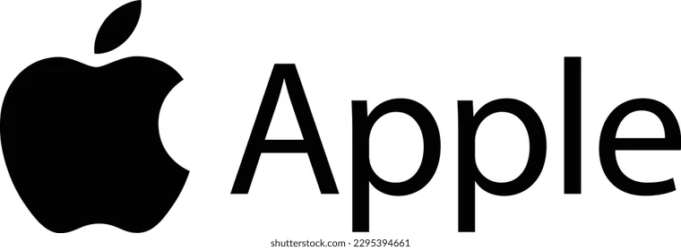

Agora vamos para a Apple
um sistema até que bom, pois conta com:
- Segurança e Privacidade
    - Mesmo possuindo um vazamento no seu histórico (Mega Vazamento de 2025), é menos constante que os do Windows
    - Apple também costuma ser mais criteriosa em relação à sua privacidade, mas continua sendo empresa fechada
- Estabilidade e Desempenho
    - Ecossistemas da Apple sempre funciona bem, pois não tem muita variedade de Hardware ou de Kernel
- Integração no Ecossistema
    - Para quem já usa Iphone já facilita
- Interface e Acessibilidade
    - Fácil de usar no geral.

> Kernel: é a parte mais central e fundamental de um sistema operacional (como Windows, Linux, Android ou macOS). Ele funciona como uma "ponte" ou intermediário essencial entre o software (aplicativos) e o hardware (os componentes físicos, como CPU)

Mas também conta com as desvantagens de:
- Custo Elevado
    - Apple sempre tem custo elevado para todos os produtos.
- Hardware Fechado
    - Não permite liberdade de atualização de ram ou SSD
- Software Limitado
    - Grande maioria é feito para o Windows

Não tem muito o que fazer para melhorar o Apple além dos passos dos próximos tópicos.

## Linux
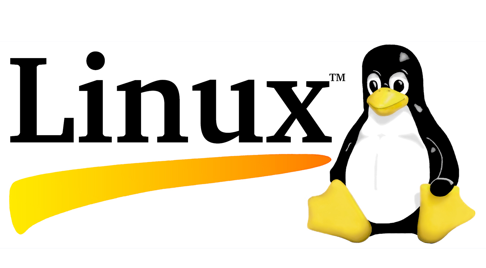

Agora vamos entrar nas distribuições **linux**  
> nota: _Tem muita variedade de distros Linux, citarei vantagens de linux e depois umas Distros especificas._

Vantagens do linux:
- Código aberto
- Variedade de Distro (tem para todo tipo)
- Customização
- Não é centralizado
- Seguro (pelo próprio conceito de ser open-source)
- Gratuito

> Distro: Abreviação de distruibuição (já que o linux é distribuido)

Mas também como todos SO, ele tem suas desvantagens:
- Jogos (normalmente), tem menos compatibilidade
    - Já foi resolvido pela Valve, e pelo Wine
- Diferente do Windows
    - Como a grande maioria vem do windows pode estranhar no começo
- Alguns Jogos (Como da Riot) ou Programas (como da Adobe) pode não funcionar

Mas como o Linux tem DIVERSAS distribuições, você sempre vai achar alguma para se adequar  
Citações rapidas de distros famosas:
- Linux mint 
    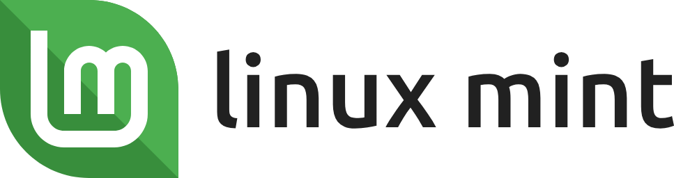  
    - Porta de entrada ao linux, rápido, leve, parece com o Windows, Ótimo para iniciantes.
    - [Baixe o Mint](https://linuxmint.com/download.php)
- Linux Zorin 
    
    - Eu diria que uma ótima porta de entrada para quem vem de Mac, pois é bem parecido, em questão de aparência e funcionamento.
    - [Baixe o Zorin](https://zorin.com/os/download/)
- Linux Debian
    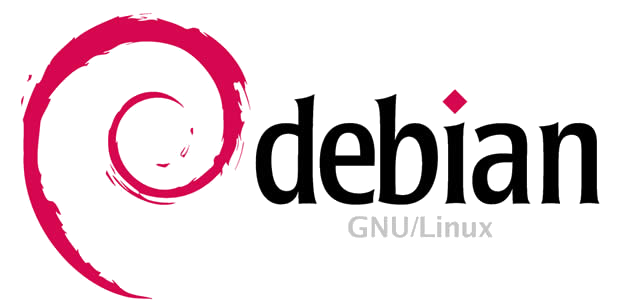
    - Linux estável e super daora, tem diversas variações (para server ou para uso pessoal), foco dele é a estabilidade.
    - [Baixe o Debian](https://www.debian.org/distrib/)
- Linux Ubuntu

    - Muito bom, mas eu particulamente não gosto, acho feio travado e com muitos problemas (focado em "inovação"), então atualizações podem não estar super otimizadas
    - [Baixe o Ubuntu](https://ubuntu.com/download/desktop)
- Arch Linux
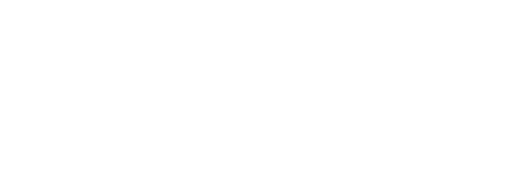
    - se você quiser fazer seu computador do zero, se aventure. recompensa com muito orgulho por ter montado você mesmo, e alta customização.
    - [Baixe o Arch](https://archlinux.org/download/)
- Pop Os

    - ficando famoso por ser famoso e rápido também, instalação super fácil
    - [Baixe o Pop OS](https://system76.com/pop/download/)

Esses são os linux mais comuns, e tem mais privacidade e segurança que o Windows e o Mac. Mas se você busca realmente um mais privado e anônimo, vem as distros focadas nisso...

### Tails
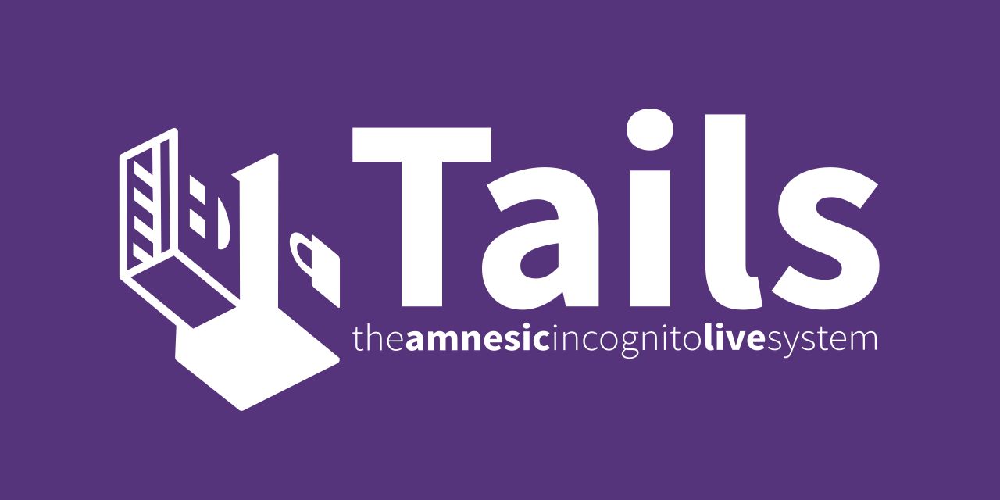

O [Tails Os](https://tails.net/) ele é um sistema operacional portátil que te protege de vigilância e censura.

Tails usa a rede Tor(entenderá no tópico de [redes](#tipos-de-redes)) para proteger sua privacidade online e te ajudar a evitar censura. Desfrute a Internet da forma como ela deveria ser.

Você pode baixar Tails gratuitamente e pesquisadores independentes da área de segurança podem verificar o nosso trabalho. Tails é baseado em Debian GNU/Linux.

Quem usa o tails:
- Ativistas
- Jornalistas e suas fontes
- Sobreviventes de violência doméstica
- Você
    - toda vez que precisa de mais privacidade neste mundo digital.

Ele é um sistema operacional inteiro dentro de um pendrive.  
"Mas porque ele é tão seguro?"  
Porque o Tails funciona na memória ram, nunca escreve nada no disco rígido, ou seja quando você desliga ele, tudo perde, e fica como se nunca tivesse usado nada.  
Além disso todos os dados passam pela rede Tor, O que faz ser mais dificil alguém te rastrear.  
"Mas eu terei que reconfigurar ele toda vez?"  
Não, ele tem um modo persistente, que salva algumas coisas, mas você escolhe o que ele salva, o resto é apagado.

#### Como Baixar o Tails

_Lembrando: **ele foi feito pra ser baixado em um pendrive, mesmo possuindo outras opções de download, ele foi feito para pendrives**._

+ Entre no [site deles](https://tails.net/install/download/index.pt.html)  
+ Faça o download  
+ Grave num pendrive
+ inicie o computador por ele
+ seja anonimo
+ **IMPORTANTE: EVITE CORRELACIONAR VOCÊ COM O SEU EU DIGITAL, PARA SER MAIS SEGURO**

é um ótimo sistema para quem quer privacidade ou está sofrendo algum tipo de perseguição.

### Whonix
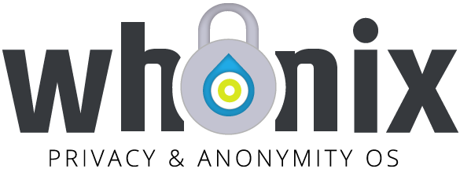  
O [Whonix](https://www.whonix.org/) é um sistema operacional focado em anonimato, e ele funciona de uma forma bem diferente dos outros: ele roda dentro do seu sistema atual, usando virtualização.  
A ideia central é simples mas muito útil ele se divide em duas máquinas virtuais:
1. Gateway: é o "porteiro". Todo o tráfego de rede passa por ele, e ele força tudo pela rede Tor. Você nunca interage diretamente com ele.  

2. Workstation: é onde você realmente usa o computador. Navega, escreve, trabalha. O detalhe importante: ela não sabe nem qual é seu IP real. Ela só se comunica com o Gateway, que cuida do resto.  

> Isso significa que mesmo que um vírus ou malware infecte seu Workstation, ele fisicamente não consegue descobrir ou vazar seu IP real, porque essa informação simplesmente não existe lá dentro.  

Como usar:
> _Você vai precisar instalar um software de virtualização primeiro. O mais comum é o VirtualBox (gratuito)_  

- Baixe e instale o VirtualBox
- Acesse o site do Whonix e baixe as duas imagens (Gateway e Workstation)
- Importe as duas no VirtualBox
- Inicie primeiro o Gateway, depois o Workstation
- Use normalmente pelo Workstation

> Notas: _O Whonix não substitui boas práticas de OPSEC. Ele protege seu IP, mas não protege você de se identificar por outros meios._  

>Limitações:  
_Depende do sistema operacional hospedeiro (o seu Windows/Linux de baixo)  
Se o seu sistema base estiver comprometido, o Whonix pode ser afetado  
Requer um computador com pelo menos 4GB de RAM (recomendado 8GB+)_


### Qubes Os
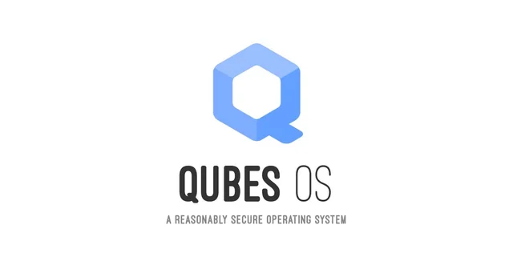  
Se o **Whonix** protege seu IP, o **Qubes OS** protege tudo o mais. Ele é considerado por muitos especialistas como o sistema operacional mais seguro para uso pessoal que existe.   
> Mas vem com um aviso honesto: ele é difícil. Não é para quem está começando hoje. É o passo seguinte depois que você já se acostumou com Linux.
A ideia principal: ***compartimentalização***  

Sabe quando você não quer misturar conta pessoal com conta do trabalho? O Qubes leva isso a um nível extremo.  
Cada atividade roda em uma máquina virtual separada, chamada de qube. Por exemplo:  
| Qube | O que você faz nele  | 
| --- | --- |
|work | E-mails e documentos do trabalho |  
| personal |Redes sociais, uso pessoal | 
| bank | Somente acesso bancário | 
| anon | Tudo que precisa de anonimato (pode rodar Whonix aqui dentro)|   
| vault | Senhas, arquivos sensíveis — sem internet |

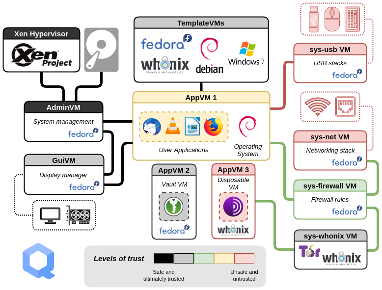

A parte genial: se você abrir um arquivo malicioso no qube work, ele não consegue afetar seu personal, seu bank, nem nada mais. **Cada qube é uma ilha.**

Resumindo em uma frase: No Qubes, um vírus que te infecta fica preso numa caixa e não chega em mais nada.

### Whonix dentro do Qubes:
Esses dois funcionam muito bem juntos. O Qubes tem suporte nativo ao **Whonix**  
 você pode ter um qube específico para atividades anônimas que passa todo o tráfego pelo Tor via Whonix, enquanto o resto do sistema funciona normalmente.

Requisitos de hardware:
> Esse é o ponto de atenção.  

O Qubes é pesado:

**Mínimo**: 6GB RAM (na prática fica SUPER lento)  
**Recomendado**: 16GB RAM ou mais  
**Processador com suporte a virtualização** (Intel VT-x / AMD-V)  
**Verifique se seu hardware é compatível na lista oficial**  

### Como instalar:

+ Acesse o [site deles](qubes-os.org)  
+ Baixe a ISO e grave num pendrive (usando Rufus ou Balena Etcher)  
+ Inicie pelo pendrive e siga o instalador
+ Na configuração inicial, você já pode habilitar o Whonix como template de rede anônima


> ***Aviso real: Se você nunca usou Linux, use antes de tentar o Qubes. Ele vai exigir que você saiba o básico de terminal e resolução de problemas.***


e com isso chegamos ao fim das distros (mais famosas) para anonimato e privacidade.  
Considere elas como niveis, onde o Qubes os é o nível máximo, (mais que isso seria usando um computador e EXPLODINDO ele em seguida (e jogando no mar(nas fossas das marianas se possivel)) ou simplesmente não usando a internet :P)

Agora que temos um SO mais seguro, vamos aprender como nos proteger em relação à você ser correlacionado...


# Personas
  
Você aprendeu OPSEC, aprendeu a usar sistemas seguros, emails privados. Mas tudo isso cai por terra se você age igual em todo lugar.  
Uma persona é uma identidade que você constrói para usar na internet, totalmente separada de quem você é de verdade. Não é mentira por diversão, é uma camada de proteção.

O maior erro de quem tenta ser anônimo não é técnico. É comportamental. As pessoas se entregam pelo jeito de escrever, pelos horários que postam, pelas opiniões que repetem.

## O que é:

É meio que a criação de um personagem, que você vai atuar como ele, sempre que tiver que ser igual ele.   
Exemplo: Se você criou o joão, para um forum ou um email, você sempre terá que ser igual a esse joão, para manter a constância.

## Como fazer:
Uma boa persona precisa ser consistente. Isso significa:

**Nome e identidade**: escolha um nome que não tenha ligação com o seu. Nada de usar seu apelido real, data de nascimento, cidade, time de futebol.  
**História**: defina o básico: país, área de atuação, interesses. Você não precisa de uma biografia completa, mas precisa de respostas prontas para perguntas comuns.  
**Estilo de escrita**: se você sempre usa reticências e escreve tudo em minúsculo na vida real... não faça isso na persona. Estilo de escrita é uma impressão digital.  
**Comportamento**: horários de postagem, tipo de conteúdo que curte ou compartilha, como responde críticas. Tudo isso forma um padrão.  


> Regra de ouro: nunca saia do personagem. Uma única mensagem no estilo errado, um comentário pessoal demais, já pode ser suficiente para correlacionar você à persona.  

Um site para ajudar você a fazer uma persona (existe vários):  
- [Fake Person Generate](https://www.fakepersongenerator.com/), para você gerar tudo como:  
    - altura, cidade, data de nascimento, nome, raça, tipo sanguineo e tudo
- Nesse mesmo site tem varios outros geradores para você usar.
    - Lembre-se de manter a coerência sempre.
- [This Person does not exit](http://this-person-does-not-exist.com/en), gera a imagem inicial de sua persona, cria uma conta no gemini ou tanto faz, e gera imagens  de outros ângulos, ou até fotos para redes sociais

## Avisos/Regras
Erros que quebram as camadas:

- Usar o mesmo email em duas personas
- Copiar um texto de uma conta para outra
- Mencionar algo pessoal que só você saberia
- Acessar duas personas do mesmo dispositivo ou rede

Não é tão difícil quanto parece.

## Como "Matar" uma Persona
Quando uma persona for comprometida — ou você simplesmente não precisar mais dela, você faz o seguinte processo:

- Pare de usar imediatamente. Nenhuma despedida, nenhuma última mensagem.  
- Delete as contas associadas: redes sociais, fóruns, qualquer cadastro.  
- Abandone os emails vinculados a ela. Não reutilize em outra persona.  
- Não mencione ela em nenhum outro lugar, nem indiretamente.  
- Descarte qualquer dispositivo ou sessão que tenha sido usado exclusivamente por ela, se possível.  
    - VM, celular descartavel, chip descartavel e etc.

Uma persona morta precisa desaparecer de verdade. Se você "mata" ela mas continua com os mesmos padrões de escrita numa nova conta, para quem está rastreando é a mesma pessoa.

#### Resumo
Uma persona não é um personagem de ficção. É uma disciplina. Você **precisa manter ela separada de você** em todos os aspectos:   
técnico, comportamental e emocional.   
**Quanto mais você a humaniza com detalhes seus, mais fraca ela fica.**

Agora que temos a persona, Vamos fazer a criação de tudo que é necessário para internet hoje em dia.

# Emails

Vamos agora para uma coisa essencial, que é necessário para tudo na internet.
O Email.  
"Ah mas eu uso o gmail", o email da maior bigtech existente, obviamente não será privado, seus dados são usados para treinar IA e para propor anúncios a você.
Eu particulamente gosto de alguns provedores de email:

1. **ProtonMail** (pode acostumar com a proton pois vai aparecer ainda muitoo aqui).
2. **Posteo** 
3. **Tuta** (antigo Tutanota)

vamos passar por cada desses e dizer suas características e vantagens e desvantagens.

****
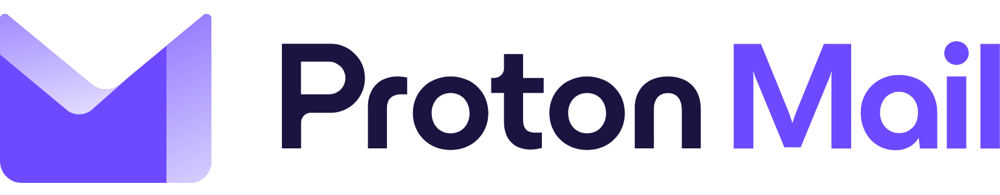
## ProtonMail

### Apresentação da Proton
Normalmente esta é a porta de entrada para os serviços da Proton. Mas quem é a **[Proton](https://proton.me)**?  
> "Proton é uma organização sem fins lucrativos cuja missão é lutar por uma internet aberta que promova a liberdade de expressão e a liberdade de informação."
> — própria Proton, no site deles.  

Em um rápido resumo a Proton é uma empresa que serve os mesmo serviços que a Google, mas com o diferencial que prezam pela liberdade e privacidade (tópico discútivel, mas de fato mais prezam mais que o Google).

### **Serviço de Email** 

O serviço de Email deles, é uma ótima oportunidade para quem quer começar nessa vida, pois:
- É fácil de usar
- Tem versão gratuita
- Ótima compatibilidade
    - celular, Pc, tanto faz.
- Aceito em diversos sites sem restrições
- Além de ser considerado profissional

mas como tudo tem suas **desvantagens**:

- Preço (o menos criterioso, pois se você não paga nada, você é o produto).
    - se quiser o minimo de conforto tem que desembolsar um valor minimo de **R$10,50** até **R$52,49**. 
- Já teve casos de entrega de dados (toda empresa do Proton não apenas Email)
    - Para quem desconsidera uso de qualquer ilegalidade ou extremidade contra algum governo. Pode ignorar e seguir para o Proton pois no geral o serviços deles são completos.

Em resumo é isso, o ProtonMail é uma ótima porta de entrada para o mundo da privacidade digital.

____

## Posteo

**[Posteo](https://posteo.de/en)** é um serviço de email da Alemanha _(sim faz parte dos X olhos, mas a proposta é bem daora)_.  
O Posteo é um serviço independente de Email Open-Souce que fica em Berlim, é totalmente engajado com:
- Sustentabilidade
    - Servidores utilizam 100% de energia renovavel.
    - Sem voos comerciais desde a sua fundação em 2009.
    - Doações regulares para ONGS.
    - Progamação otimizada para eficiência energetica.
- Segurança
    - TLS (protocolo de criptografia) em envio ou recebimento de emails.
    - Todo armazenamento de Email criptografado
        - Até os discos rígidos.
    - Login com 2 fatores.
- Privacidade
    - Não coleta dados pessoais.
    - Sem conexão de dados de pagamentos
        - Pagamentos são feitos por PayPal, transferência bancária, cartão de crédito ou em dinheiro.
        - Vouchers, Você pode transferir seu crédito para alguém, como um membro da familia por exemplo.
        - Pagamentos são pré-pagos e mensais, se você não terminar sua conta antes (14 dias antecipados), você pode doar os créditos restantes para uma ONG ou receber de volta. 
    - Sem rastreio, sem vender dados de clientes (entenderam porque não é usuário).
    - Não coleta IP pessoal
    - Backups de segurança, filtro de virus altamente eficiente.
- Usabilidade
    - Livre de anúncios.
    - Sem integração com o Google ou serviços de rede social.
    - Filtro de spam.
    - Não enviam emails de anúncios.
    - Migração de Emails antigos
        - Encriptados e com estrutura de pastas/diretórios
        - Sem parceiros externos envolvidos
    - Além de servicos de personalizações como:
        - Cores
        - Calendários
        - Bloco de Notas
    - Pra finalizar tem:
        - 4 GB de espaço, pode fazer upgrade.
        - 2 endereços alias, pode fazer upgrade.
        - Compatibilidade com todos os serviços.

> Alias: é um apelido ou endereço alternativo associado à sua conta de e-mail principal. Todas as mensagens enviadas para o alias vão para a mesma caixa de entrada, permitindo organizar e-mails, proteger sua privacidade (ao usar em sites) e gerenciar múltiplos endereços.

"Mas então qual a desvantagem dele em relação ao proton?"  
Ele não possui serviço gratuito. Tudo isso que citei, está incluso no plano de **1 euro por mês**  
Os upgrades são (acréscimos mensais):
- Espaço adicional: 0,25 EUR por GB.
- Alias de email adicional: 0,10 EUR.
- Calendários adicionais: 0,10 EUR (3 calendários).

**Desvantagens**:  
Sinceramente nunca ouvi nóticias sobre entrega de dados desse email, mas talvez por motivos de nenhuma autoridade ter batido lá ainda, então fica como nunca entregou ninguém.

___

## Tuta

**[Tuta](https://tuta.com/)** é o antigo tutanota, é um serviço de Email Open-Source

Ele conta com:
- Energia 100% renovavel
- TODO conteúdo do email criptografados
    - Armazenamento, linhas de assuntos e etc.
- Política de não registro de log
- Autenticação U2F em dois fatores
- Domínios personalizados
    - endereços ilimitados para seu domínio personalizado.
- Número ilimitado de domínios
- Clientes de código aberto e aplicativos
- Sem anúncios
- Versão gratuita
- Criptografia pós quântica
    - Protegido agora e no futuro
- Nenhum vínculo com Big Tech
    - Enquanto ProtonMail usa serviços terceirizados com código fechado, Tuta Mail é completamente desvinculada do Google. Tuta construiu uma alternativa de código aberto ao serviço de notificação push do Google e publica seus aplicativos para Android no F-Droid.

Um serviço bem completo. Eu particulamente gosto bastente do tuta.  
Ele tem 2 Formas de pagamento, Mensal e anual, e tem 3 Planos:

1. Plano Free
    - 1GB de armazenamento
    - um calendário
    - 3 etiquetas

2. Revolutionary
    - 20GB de armazenamento
    - Numero ilimitado de etiquetas
    - 15 endereços de emails adicionais
    - Opção familia
    - 3 Domínios personalizados (you@apelido.com)  
    > Por **3.60 Euros por mês** ou **3 Euros no plano Anual**.
    (inclui impostos)
3. Legend
    - 500 GB de armazenamento
    - Número ilimitado de etiquetas
    - 10 Domínios personalizados
    - 30 endereço(s) de e-mail adicionais
    - Opção familia
     > Por **9.60 Euros por mês** ou **8 Euros no plano Anual**.
    (inclui impostos)

Metodos de pagamentos:  
cartões de crédito (Visa, Mastercard, Amex), PayPal e criptomoedas (Bitcoin, Monero) através da Proxystore para anonimato máximo.

Aqui tem o mesmo caso do Posteo, sem vazamentos de dados ou historico de entrega de usuários, mas não sei se é porque nunca bateram na porta ou porque eles realmente não entregam.

## Emails extras

Para muita coisa na web, precisamos de um método de login ou de um email básico apenas para uma recebimento de código, para isso apresento o conceito de emails temporários 
> Observação: Sempre vai existir dezenas de provedores desses emails, por agora citarei apenas alguns...

### Tua mãe aquela ursa

Talvez um dos mais famosos serviços disso, [Tua mãe aquela ursa](https://tuamaeaquelaursa.com/) recebe o email para você poder se cadastrar em um site ou tanto faz o que você queira fazer.

###  GuerrilhaMail

Esse já é mais underground, mas mesmo propósito, [Guerrilha Mail](https://www.guerrillamail.com/pt/) tem um diferencial, ele permite você enviar email também, não apenas receber (pode estar indisponivel), e também oferece serviço de endereço alias

### TempMail

O [TempMail](https://temp-mail.org/pt/) lhe fornece um endereço de email descartável, gratuito, anônimo, seguro e temporário. Talvez o mais conhecido já que é o primeiro das buscas.

 ___
"Mas eu quero o google"

Então utilize uma _persona_, e **NUNCA, NUNCA saia do seu papel**.  
ou saia e seja correlacionado.

### Resumo
Sempre existirá diversos emails, tantos privados, como Temporarios, então sempre busque alternativas e pode até me mandar que adiciono nesse documento, ou faz um Merge, tanto faz.
____

# Browsers
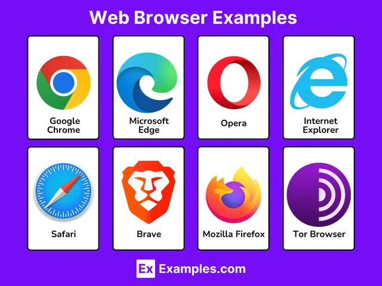
Você cuida do seu sistema operacional, do seu email, da sua persona, mas o browser é onde você passa 90% do tempo na internet. E ele acaba com todo o trabalho que você teve.

## Como um browser te expõe: 
Não é só o seu IP. O browser vaza o que chamamos de *fingerprint* uma impressão digital digital formada por:  
- Qual SO você usa
- Qual fonte está instalada no seu sistema
- Resolução de tela
- Fuso horário
- Idioma do teclado
- Extensões instaladas
- Hardware da sua máquina  

Junta tudo isso e você vira uma combinação única. Mesmo sem cookies, sem login, sem nada. Sites conseguem te reconhecer só pelo fingerprint.

Exemplo: você abre uma aba anônima no Chrome, acessa um site de notícias. Sem login, sem cookie. Mas o site sabe que é você, porque seu fingerprint é o mesmo de sempre, mesma tela, mesma rede, mesmo SO, mesma fonte, mesmo horário. A aba anônima só esconde o histórico local. Não esconde você.

> Nota: _isso é um nivel de "paranoia" alta, como este guia é focado em iniciantes irei apenas cobrir maneiras básicas de se proteger._

Agora vamos para lista de browsers e seus pros e contras:

## Chrome
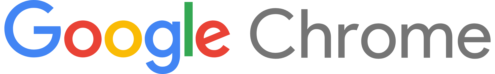
O browser mais usado do mundo, e o pior para privacidade (novidade).  
Feito pelo Google, uma empresa cujo negócio principal é vender anúncios baseados no seu comportamento.  
O Chrome coleta telemetria constante, sincroniza tudo com sua conta Google por padrão, e tem histórico de resistência em implementar funcionalidades que prejudiquem o modelo de anúncios da empresa (como bloquear cookies de terceiros, prometido e adiado várias vezes).  
### Prós:

- Rápido e compatível com tudo
- Ecossistema de extensões enorme

### Contras:

- TUDO (kkk brincadeira).
- Telemetria constante para o Google
- Código parcialmente fechado
- Modelo de negócio baseado nos seus dados
- Modo anônimo não é anonimato, o proprio Google admitiu isso em processo judicial.

Resultado:
**_Evite para qualquer coisa que envolva privacidade._**

## Edge
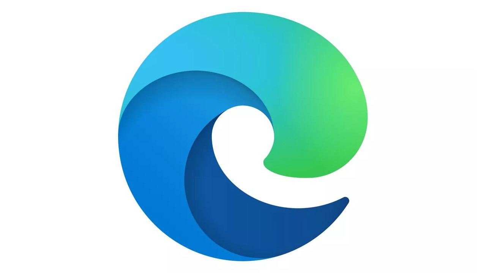
O Chrome da Microsoft (se você usa merecia um tiro). Literalmente é baseado no mesmo motor (Chromium).  
A Microsoft faz o mesmo jogo do Google: coleta dados para treinar IA e personalizar anúncios. Vem instalado forçado no Windows e tem recursos como o Copilot integrado que mandam dados para servidores da Microsoft por padrão.  

### Prós (poucos):

- Compatível com extensões do Chrome
- Integrado ao Windows (conveniente para quem não liga para privacidade)

### Contras:

- Telemetria agressiva
- Código fechado
- Vem com rastreamento ativado por padrão
- Parte da mesma empresa que faz o Windows, que já vimos como trata privacidade

Resultado:
***Mesma situação do Chrome. Evite.***

## Safari
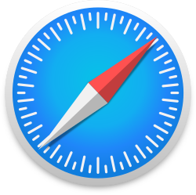  
O browser da Apple. Melhor que Chrome e Edge em privacidade, mas ainda fechado.  
A Apple tem um modelo de negócio diferente, vende hardware (e status), não anúncios. Isso faz com que tenham menos incentivo para te rastrear.  
O Safari tem proteção contra fingerprinting e bloqueia rastreadores entre sites por padrão. Porém, o código é fechado e você precisa confiar na Apple.

### Prós:

- Melhor privacidade entre os browsers proprietários
- Proteção anti-rastreamento nativa
- Integração com ecossistema Apple

### Contras:

- Código fechado, você tem que confiar na Apple sem verificar
- Só disponível em dispositivos Apple
- Atualizações dependem da Apple

Resultado:
***Aceitável se você está no ecossistema Apple e não quer mudar muito. Mas não é para anonimato.***


## Firefox
  
O grande browser open-source de uso geral. Base de muita coisa boa que vem a seguir.  
Desenvolvido pela Mozilla, uma fundação sem fins lucrativos. O código é aberto, auditável, e tem uma comunidade enorme de segurança.  
Por padrão não é perfeito, vem com telemetria ativada e algumas configurações que podem ser melhoradas, mas é altamente configurável.  

### Prós:

- Open-source
- Extensões poderosas (uBlock Origin, etc.)
- Altamente configurável via about:config
- Base confiável e auditada

### Contras:

- Telemetria ativada por padrão (pode desativar)
- Configuração padrão não é ideal para privacidade
- Mozilla depende parcialmente do Google (contrato de busca padrão)

Resultado:
***Boa escolha para uso geral. Melhor ainda com configurações ajustadas.***


## LibreWolf
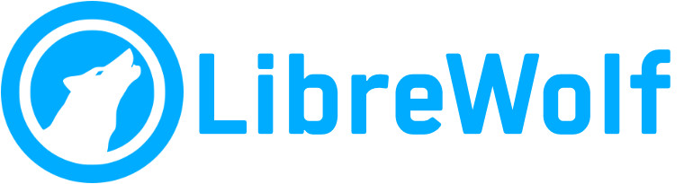
O Firefox sem as partes ruins.  
É um fork do Firefox que remove toda a telemetria, desativa rastreamento por padrão, vem com uBlock Origin instalado, e aplica configurações de privacidade que você teria que fazer manualmente no Firefox.  
Mesma compatibilidade, mesmas extensões, mas já configurado do jeito certo.
### Prós:

- Firefox sem telemetria
- Configurações de privacidade aplicadas por padrão
- uBlock Origin incluso
- Open-source

### Contras:

- Atualizações chegam um pouco depois do Firefox
- Alguns sites podem ter comportamento estranho pelas configurações mais rígidas
- Menor comunidade de suporte que o Firefox original

Resultado:
***Recomendado como substituto direto do Firefox para quem quer privacidade sem configurar tudo na mão.***

## Brave
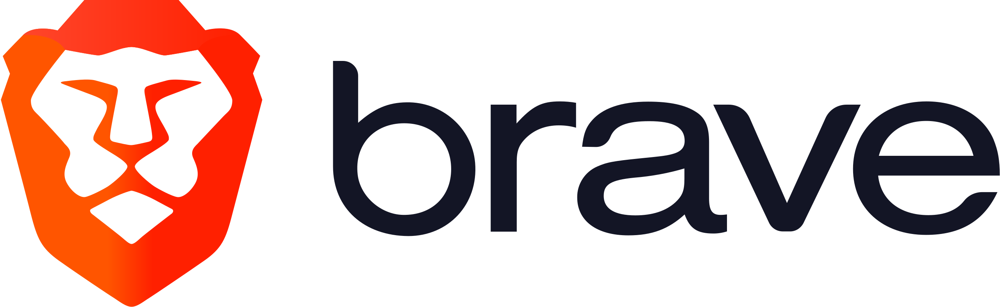
Browser baseado em Chromium com foco em privacidade. Popular, mas polêmico.  
Bloqueia anúncios e rastreadores por padrão, tem proteção contra fingerprinting, e é rápido.   
O problema é o histórico da empresa: já foi pego redirecionando links de afiliados sem avisar o usuário, tem seu próprio sistema de anúncios e criptomoeda (BAT) embutido, e algumas decisões de negócio geraram desconfiança na comunidade de privacidade.  
### Prós:

- Bloqueio de anúncios e rastreadores nativo
- Rápido (base Chromium)
- Proteção contra fingerprinting
- Compatível com extensões do Chrome

### Contras:

- Empresa com histórico de decisões questionáveis
- Sistema de anúncios próprio embutido (pode desativar)
- Base Chromium, motor do Google <- bigtech  
- Criptomoeda integrada que muita gente não quer

Resultado:
***Melhor que Chrome para privacidade, mas o histórico da empresa pede cautela. LibreWolf é mais confiável se o objetivo for privacidade de verdade.***


## Tor Browser
  
O browser de anonimato por excelência.  
Desenvolvido pelo Tor Project, ele roteia todo o tráfego pela rede Tor. 

> Rede tor o que é: passando por múltiplos servidores ao redor do mundo antes de chegar ao destino, tornando extremamente difícil rastrear sua origem.  

Vem com proteção anti-fingerprinting agressiva e sem nenhuma telemetria.  
### Prós:

- Anonimato real de IP pela rede Tor
- Anti-fingerprinting forte
- Sem telemetria
- Open-source e auditado

### Contras:

- Lento, por causa da rede Tor adiciona latência por design
- Muitos sites bloqueiam conexões Tor
- Não instale extensões(depende)
- Não faça login em contas pessoais, quebra o anonimato

Resultado:
***O mais poderoso para anonimato. Mas só funciona se você seguir as regras de uso. Mas para uso mais agressivo para um iniciante é mais que suficiente***

## Mullvad Browser
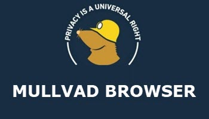  
O Tor Browser sem a rede Tor, feito para usar com VPN.  

Desenvolvido em colaboração entre a Mullvad VPN e o Tor Project. Tem as mesmas proteções anti-fingerprinting do Tor Browser, mas em vez de usar a rede Tor, é pensado para usar com uma VPN de confiança.  
Roda em modo privado por padrão, vem com uBlock Origin, e tem um botão de reset de identidade que apaga cookies e histórico com um clique.  

*A ideia central é que todos os usuários pareçam iguais, sem fingerprint único.*
### Prós:

- Anti-fingerprinting forte (mesmo princípio do Tor Browser)
- Modo privado por padrão
- uBlock Origin incluso
- Open-source, feito com o Tor Project
- Sem telemetria

### Contras:

- Quebra alguns sites (CAPTCHA, Cloudflare, logins complexos)
- Não é recomendado para uso casual do dia a dia, mas eu discordo.
- Requer uma VPN confiável para funcionar bem
- Pouca customização por design (intencional, mas pode incomodar usuários)

Resultado:
***Excelente para sessões específicas que precisam de privacidade forte. Não substitui um browser do dia a dia.***


## Epiphany (GNOME Web)
  
Esse entrou como menção honrosa para hardwares antigos.  
O browser padrão do ambiente GNOME no Linux. Simples, leve, e honesto sobre o que é.  
Não é um browser de privacidade avançada, os próprios desenvolvedores deixam claro no site que ele não é adequado para anonimato real.  
Mas tem bloqueio de anúncios e rastreadores ativados por padrão, não tem telemetria enviada para desenvolvedores, e é completamente open-source. É leve e integra bem com desktops Linux baseados em GNOME.  
### Prós:

- Open-source
- Leve e rápido em hardware antigo
- Bloqueio de rastreadores por padrão
- Sem telemetria para desenvolvedores
- Boa integração com GNOME

### Contras:

- Sem suporte a extensões
- Não indicado para anonimato (os próprios devs dizem isso)
- Instável em alguns sites pesados
- Comunidade pequena, menos atualizações de segurança

Resultado:
***Útil como browser secundário no Linux para tarefas simples. Não use para nada que exija privacidade séria.***

|Browser | Para quem é | Nota Geral|
| --- | --- | --- |
| Chrome / Edge |Evite| 5 |
| Safari | Usuários Apple que não querem mudar muito | 6 |
| Firefox | Uso geral, boa base | 7 |
| LibreWolf | Firefox já configurado para privacidade | 8 |
| Brave | Alternativa ao Chrome, mas com ressalvas | 7 |
| Tor Browser | Anonimato real | 10 |
| Mullvad | Sessões privadas com VPN | 9 |
| Epiphany Browser | leve secundário no Linux| 7 |


Saindo do Ehrome e Edge já é um avanço.  
Tor Browser é suficiente para qualquer pessoa, que não esteja sendo super procurada.


# Mecanismos de Busca

Você trocou o browser, configurou a VPN, está usando Tor. Mas ainda pesquisa no Google.

Tudo que você digita na barra de busca é dado. Dúvidas de saúde, problemas financeiros, opiniões políticas, curiosidades que você não contaria para ninguém, o Google guarda tudo isso, vincula ao seu perfil, e usa para te mapear com uma precisão que nenhum outro serviço consegue.

Trocar o mecanismo de busca é uma das mudanças mais simples e mais imediatas que você pode fazer.

## Como o Google te rastreia na busca

Cada pesquisa que você faz é armazenada com seu IP, seu dispositivo, sua conta Google se estiver logado, e o horário exato. O Google e o Bing constroem perfis detalhados sobre você a partir desses dados: saúde, finanças, produtos que quer comprar. E usam isso para publicidade personalizada.

O modo anônimo não resolve. O modo incógnito simplesmente para de salvar seu histórico local, mas seu provedor de internet, anunciantes e mecanismos de busca continuam monitorando o que você faz.

---

## Os mecanismos

### Google / Bing
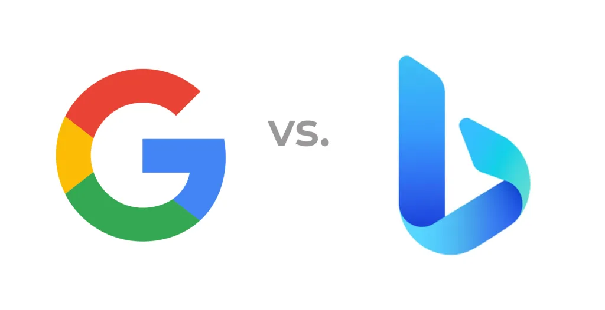
Não são mecanismos de privacidade, são produtos. E produtos de vigilância que também fazem busca. Tudo que você pesquisa alimenta o perfil que eles têm sobre você. Evite para qualquer coisa sensível.

---

### DuckDuckGo  
  
O mais popular entre os alternativos. Sediado nos EUA, mas com política clara de não rastreamento.

O DuckDuckGo não coleta nem armazena informações pessoais. IPs não são registrados e não há perfis de usuário. A maior parte dos resultados vem do Bing e de outras fontes, o que significa que a qualidade é boa para a maioria das buscas do dia a dia.

Tem um recurso chamado **!bangs**, atalhos que permitem buscar diretamente em outros sites. `!yt termo` busca no YouTube, `!w termo` busca na Wikipedia, e assim por diante.

**Prós:**
- Sem rastreamento, sem perfis
- Interface limpa e familiar
- !bangs muito úteis
- App mobile com bloqueio de rastreadores

**Contras:**
- Sediado nos EUA = 5 Olhos <- perigoso por ser 5 olhos
- Resultados dependem do Bing
- Código parcialmente fechado

**Acesse:** [duckduckgo.com](https://duckduckgo.com)

> Boa porta de entrada. Melhor que Google para uso geral sem exigir configuração nenhuma.

---

### Startpage
  
O Google, mas sem o Google te ver.

O Startpage funciona como um proxy para o Google, removendo todos os dados identificadores antes de fazer a consulta. Seu IP e suas pesquisas nunca chegam aos servidores do Google. O resultado é qualidade de busca Google com privacidade real.

Tem um recurso chamado **Anonymous View**, abre os resultados através de uma camada extra de privacidade, mascarando sua identidade ao visitar os sites.

Um ponto de atenção: o acionista majoritário do Startpage é a System1, uma empresa de tecnologia de anúncios. A política de privacidade é separada e independente, mas é um fato que vale saber.

**Prós:**
- Qualidade de resultados do Google sem o rastreamento
- Sediado na Holanda, leis europeias de privacidade
- Anonymous View para abrir links com privacidade extra
- Não armazena IP nem histórico de busca

**Contras:**
- Acionista majoritário é empresa de publicidade (eu discartaria já com isso)
- Depende da infraestrutura do Google por baixo
- Já teve problemas com bloqueios para usuários de VPN e Tor (resolvido em 2024)

**Acesse:** [startpage.com](https://startpage.com)

> Melhor opção para quem quer resultados de qualidade Google sem abrir mão de privacidade.

---

### Brave Search
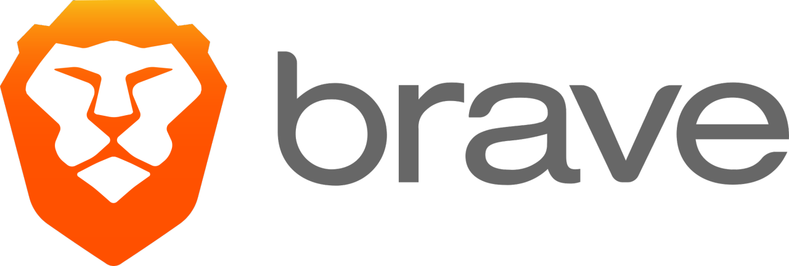
O mecanismo de busca dos mesmos criadores do Brave Browser. O diferencial é a independência.

O Brave Search atingiu independência completa de outros mecanismos de busca em 2023, não depende do Google nem do Bing para seus resultados. Tem índice próprio, sem rastreamento, e um recurso chamado **Goggles** que permite customizar como os resultados são ranqueados.

**Prós:**
- Índice próprio, não depende de Google ou Bing
- Sem rastreamento
- Goggles para customizar resultados
- Integrado ao Brave Browser

**Contras:**
- Índice menor que Google, resultados menos abrangentes em buscas muito específicas
- Empresa com histórico questionável (já citado na seção de browsers)
- Sediado nos EUA = 5 Olhos

**Acesse:** [search.brave.com](https://search.brave.com)

> Boa opção para quem quer independência do Google. Melhor que DuckDuckGo nesse aspecto específico.

---

### SearXNG

O mais poderoso, e o mais técnico.

O SearXNG é um mecanismo de meta-busca open-source que pode ser hospedado por qualquer pessoa. Ele agrega resultados de múltiplos mecanismos enquanto anonimiza suas consultas.

Consulta mais de 70 mecanismos simultaneamente como: Google, Bing, DuckDuckGo, Startpage, e especializados como Wolfram Alpha. Combinando e removendo duplicatas para dar resultados mais abrangentes.

O ponto chave: quando você usa uma instância pública do SearXNG, é importante que outras pessoas também a usem, as consultas precisam se misturar para que a privacidade funcione de verdade. Se você for o único usuário de uma instância, suas buscas ficam mais isoladas e identificáveis.

Você pode usar instâncias públicas ou hospedar a sua própria. Lista de instâncias disponíveis em [searx.space](https://searx.space).

**Prós:**
- Open-source e auditável
- Sem rastreamento nenhum
- Agrega dezenas de mecanismos
- Auto-hospedável, controle total
- Sem perfil, sem cookies, sem histórico

**Contras:**
- Interface mais básica que concorrentes
- Instâncias públicas podem sair do ar
- Depende de outros mecanismos por baixo
- Configuração mais complexa para self-hosting

**Acesse:** [searx.space](https://searx.space) para escolher uma instância

> Para máxima privacidade e controle, é a melhor opção. Requer um pouco mais de esforço que os outros.

---

## Resumo

| Mecanismo | Índice próprio | Jurisdição | Para quem é |
|---|---|---|---|
| Google / Bing | Sim | EUA | Evite |
| DuckDuckGo | Não (Bing) | EUA | Uso geral, porta de entrada |
| Startpage | Não (Google) | Holanda | Qualidade Google com privacidade |
| Brave Search | Sim | EUA | Independência do Google |
| SearXNG | Não (agrega tudo) | Descentralizado | Controle máximo |

---

# Tipos de Redes

> ***AVISO: Tópico avançado e não recomendado para usuários comuns.***
  

Você já tem o sistema seguro, o browser certo, a persona criada. Mas tudo isso ainda depende de uma coisa: qual rede você está usando para tráfego.  
A internet que você usa todo dia é só uma das opções. Existem redes paralelas, cada uma com uma arquitetura diferente, um propósito diferente, e um nível de anonimato diferente.  

## Internet Normal (Clearnet)
É a internet que todo mundo conhece, onde está: Google, YouTube, Instagram, qualquer site com endereço .com, .br, .org.  
O problema é estrutural: ela foi construída para conectar, não para proteger.  
Cada requisição que você faz carrega seu IP, seu dispositivo é identificado, seu provedor vê tudo que você acessa, e os sites registram sua visita.  
```
Você → Provedor de Internet → Site
         (vê tudo)           (vê seu IP)
```
[VPN](#vpn) e [Tor](#rede-tor) melhoram isso, mas a infraestrutura por baixo continua sendo a mesma. Você está navegando numa estrada pública, mesmo que com um carro diferente.  
### Características:

- Acesso a tudo que é indexado e público
- Rápida e compatível com qualquer dispositivo
- Sem anonimato nativo
- Cada passo é rastreável por padrão

É onde você passa 99% do tempo.

> Os próximos tópicos são as alternativas para quando isso não é suficiente.


## Rede Tor
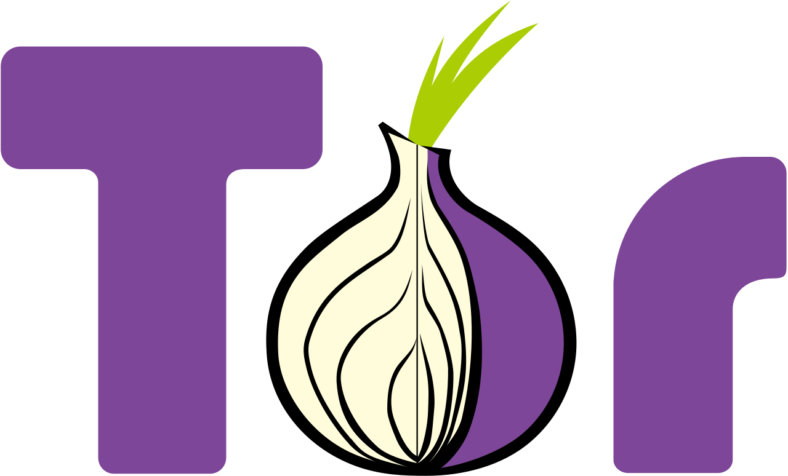  
A mais conhecida das redes alternativas, e a mais usada para anonimato real.
### Como funciona:
Em vez do caminho direto da clearnet, o **Tor roteia seu tráfego por três servidores voluntários ao redor do mundo, chamados de nós (ou relays).**  
Cada nó só sabe o passo anterior e o próximo, **nunca a rota completa.**
```
Você → Nó de Entrada → Nó do Meio → Nó de Saída → Site
         (sabe quem    (não sabe     (não sabe
          você é)       nada)         quem você é)
```
Isso se chama onion routing(roteamento cebola). Cada camada de criptografia é removida por um nó diferente, como descascar uma cebola. Nenhum nó tem a imagem completa.  
Os sites .onion são serviços que existem só dentro da rede Tor, não têm IP público, não ficam em servidor convencional, e não são acessíveis pela clearnet.  
### Como acessar: 
A forma mais simples e recomendada é o [Tor Browser](#tor-browser), já citado na seção de [browsers](#browsers). Ele já vem configurado corretamente, com todas as proteções ativas.

Não tente configurar o Tor manualmente no Firefox ou Chrome. É fácil errar e vazar dados sem perceber.  

### Prós:

- Anonimato real de IP por design
- Gratuito e open-source
- Auditado e mantido pelo Tor Project
- Acesso a sites .onion
- Usado por jornalistas, ativistas e whistleblowers no mundo todo

### Contras:

- Lento, os três saltos adicionam latência por design
- Muitos sites bloqueiam conexões Tor (Cloudflare, bancos, etc.)
- O nó de saída pode ser monitorado, nunca acesse sites sem HTTPS pelo Tor
- Não instale extensões no Tor Browser (questionável)
- Não faça login em contas pessoais, isso quebra o anonimato imediatamente
- Dizem "más" linguas, que existem relés que são da CIA ou outras inteligências e estão lá para capturar SEU tráfego...

***Para anonimato de navegação, é o padrão. Use o Tor Browser, siga as regras (principalmente da persona), e não misture com sua identidade real.***


## I2P (Invisible Internet Project)
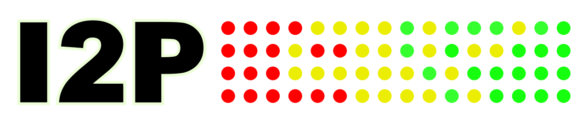
O I2P é diferente do Tor em um aspecto fundamental: ele não foi feito para acessar a internet normal. É uma rede própria, fechada em si mesma.  
### Como funciona:  
Enquanto o Tor usa três nós em sequência, o **I2P usa túneis unidirecionais** o caminho de ida é diferente do caminho de volta, e os dois usam múltiplos nós.   
Isso se chama *garlic routing* (roteamento alho) onde várias mensagens são agrupadas e criptografadas juntas antes de serem enviadas, dificultando análise de tráfego.  

```
Você → [Túnel de saída: nó A → nó B → nó C] → Destino
Destino → [Túnel de entrada: nó D → nó E → nó F] → Você
```

Cada usuário do I2P também participa da rede, (ou ajuda ou acaba "banido" da rede) você roteia tráfego de outros enquanto usa. **Não existe nó central. Não existe autoridade.**  
Os sites dentro do I2P **têm endereço .i2p** e só existem dentro da rede.
### Como acessar: 

- Baixe o roteador I2P no [site deles](geti2p.net)
- Instale e inicie, ele abre um painel de controle no browser  
- Configure seu browser para usar o proxy local do I2P  
- Aguarde alguns minutos para a rede se estabilizar  
- Acesse endereços .i2p  

> Nota: _O I2P demora alguns minutos para "aquecer" depois de iniciado, é normal e esperado. A rede precisa descobrir os pares ao redor._

### Prós:

- Mais descentralizado que o Tor, sem servidores de diretório centrais, tudo sustentado pelos próprios usuários.
- Garlic routing é mais resistente a análise de tráfego que onion routing.
- Bom para compartilhamento de arquivos anônimo (tem cliente BitTorrent interno).
- Cada usuário contribui para a rede, mais resistente a bloqueios
- Open-source

### Contras:

- Configuração mais complexa que o Tor (bom ter uma experiência prévia)
- Não acessa a internet normal diretamente
- Rede menor, menos nós que o Tor
- Mais lento no início enquanto descobre pares, depois fica mais rápido que o Tor
- Comunidade e documentação menores


***Melhor para quem quer se comunicar e compartilhar arquivos dentro de uma rede privada. Para navegar na internet >normal< com anonimato, Tor ainda é a melhor escolha.***


## Hyphanet (antiga Freenet)

> Antes de explicar o que é, uma nota importante: _o nome mudou e ficou confuso._  
**Em 2023, o projeto original chamado Freenet foi renomeado para Hyphanet. Ao mesmo tempo, um projeto novo e diferente tomou o nome "Freenet". São coisas distintas. O que você provavelmente já ouviu falar como "Freenet" é o que agora se chama Hyphanet, e é esse que vamos cobrir aqui.**

### Como funciona
O Hyphanet é diferente de tudo que vimos até agora.  
Ele não é uma rede para navegar... é uma rede de armazenamento distribuído e anônimo.  

Quando você entra no Hyphanet, você cede uma parte do seu disco rígido para a rede. Arquivos e páginas são fragmentados, criptografados, e espalhados pelos discos de vários usuários. Ninguém sabe o que está armazenando no próprio disco, os dados são criptografados e fragmentados.  
Para acessar um conteúdo, você usa uma chave criptográfica. A rede busca os fragmentos e remonta para você.  
O resultado: conteúdo que não pode ser deletado ou censurado, porque não existe em lugar nenhum específico.  

#### Ele tem dois modos:

- Opennet: conecta a usuários aleatórios na rede global
- Darknet: conecta apenas a amigos em quem você confia, trocando chaves públicas, praticamente invisível para fora da amizade.

### Como acessar:

- Baixe no [site deles](hyphanet.org) 
- Instale, ele abre uma interface local no browser (sem configuração de proxy)
- Configure o tamanho do datastore que vai ceder
- Aguarde, a rede é lenta, especialmente no início
- Navegue pelos freesites (páginas estáticas dentro da rede)

### Prós:

- Conteúdo resistente à censura por design não pode ser deletado
- Modo darknet é extremamente difícil de detectar
- Open-source, existe desde 1999
- Não precisa configurar proxy no browser
- Funciona mesmo se o publicador original sair da rede

### Contras:

- Muito mais lento que Tor e I2P
- Conteúdo é estático, sem páginas dinâmicas, lembra internet de 1990.
- Você armazena fragmentos de arquivos de outros usuários sem saber o que são (eles não sabe dos seus também)
- Comunidade menor e menos ativa
- Não acessa a internet normal

***A escolha certa quando o objetivo é publicar ou acessar informação que não pode ser tirada do ar. Não é para navegação geral.***


## Comparativo de redes
| Rede | Para que serve | Acessa internet normal? | Dificuldade | 
| ---- | -------------- | ----------------------- | ----------- | 
| Clearnet | Uso geral | Sim | Nenhuma | 
| Tor | Navegação anônima | Sim (pelo nó de saída) | Baixa | 
| I2P | Comunicação e arquivos dentro da rede | Não (em geral)| Média | 
| Hyphanet | Publicação e armazenamento resistente à censura | Não | Média | 

## Dica Extra: Combinações
As redes não são excludentes. Alguns exemplos de combinações úteis:

- **VPN + Tor**: o provedor vê que você usa VPN, a VPN vê que você usa Tor, mas não o quê. Adiciona uma camada antes do nó de entrada.  
- **Whonix + Tor**: o Whonix já roteia tudo pelo Tor por design, essa é a combinação mais robusta para navegação anônima.  
- **I2P sobre Tor**: possível, mas complexo e lento. Usado por quem quer anonimato em camadas dentro e fora da rede I2P.  

> Nota: _Mais camadas nem sempre significa mais seguro, às vezes pode significar mais complexidade e mais pontos de falha. Escolha a combinação certa para o seu modelo de ameaça, não a mais complicada possível._

# Serviços de Chat
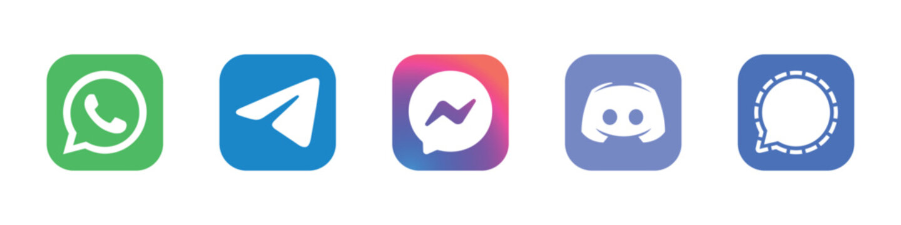
Você tem o sistema certo, o browser certo, a persona certa. Mas tudo isso não serve de nada se você manda mensagem pelo WhatsApp.  
O app de mensagens é onde você fala sobre sua vida, seus planos, suas opiniões. É onde mais os dados mais sensíveis circula, e é onde a maioria das pessoas menos presta atenção.  

## Por que WhatsApp, Discord e Instagram não são seguros
Antes de falar nas alternativas, precisa entender o problema.  
### O mito da criptografia ponta a ponta 
O WhatsApp "tem" criptografia ponta a ponta, isso é real. Significa que o conteúdo da mensagem em trânsito é "criptografado". Mas existe uma diferença enorme entre "o conteúdo está criptografado" e "você está seguro".  
O problema está nos metadados, os dados sobre a comunicação, não o conteúdo dela.  
**O WhatsApp coleta e armazena:**

- Seu número de telefone e o de todos os seus contatos
- Data, horário e frequência de cada conversa
- Seu IP, que revela sua localização bem aproximada
- Modelo do seu dispositivo, versão do sistema, versão do app
- Com quem você fala, quando, e por quanto tempo

Isso pinta um quadro completo da vida de uma pessoa, hábitos, relações sociais e rotinas, e nem precisa ler uma única palavra das mensagens criptografadas.

### CyberInsider - 1
> Exemplo real: Em 2021, um documento interno do FBI vazou mostrando o que cada app entrega para autoridades. O WhatsApp pode entregar metadados em tempo real mediante ordem judicial.
Literalmente quem falou com quem, quando, com qual frequência. O conteúdo pode estar criptografado, mas o mapa das suas relações não está.  
Mas o problema não para no metadado. Se seu histórico de conversas está em backup no Google Drive ou iCloud sem criptografia ponta a ponta ativada manualmente, é um livro aberto, governos simplesmente ignoram o WhatsApp e vão direto ao Google ou Apple com um mandado judicial.

### CyberInsider - 2
> E tem mais: em 2024, a Meta respondeu a mais de 78% das solicitações de dados de autoridades policiais envolvendo o WhatsApp. 
### CyberInsider - 3
> Multa histórica na Europa: a Comissão de Proteção de Dados da Irlanda multou o WhatsApp em €225 milhões por violar o GDPR Privacy Guides, especificamente por não informar usuários adequadamente sobre como **seus dados são usados e compartilhados com o resto da Meta.**

### E o Discord e Instagram?
Esses nem fingem ser seguros. Nenhum dos dois tem criptografia ponta a ponta nas mensagens. O Discord armazena todo o histórico de mensagens em servidores próprios por um tempinho só.... ***INDEFINIDAMENTE***.

O Instagram é parte da Meta, mesma empresa do WhatsApp e Facebook.
Se o WhatsApp já é problemático com criptografia, imagina plataformas que nem criptografia têm.  

## Telegram
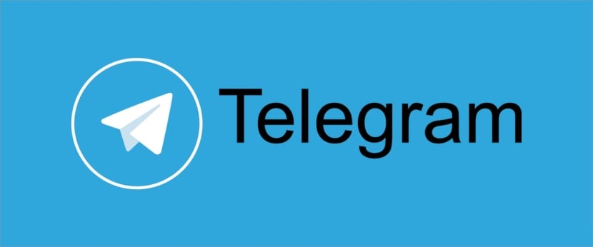
Vamos começar pelo elefante na sala. 
o app que todo mundo chama de "seguro" e que não mais é. ([prisão durov](http://g1.globo.com/tecnologia/noticia/2024/08/24/fundador-do-telegram-pavel-durov-e-preso-na-franca-diz-midia-local.ghtml))

O **Telegram** tem uma reputação de app de privacidade que nunca mereceu de verdade. Ao contrário do Signal, WhatsApp e iMessage, que têm criptografia ponta a ponta por padrão, os chats normais do Telegram usam criptografia cliente-servidor Privacy Guides, o que significa que **os servidores do Telegram conseguem ler suas mensagens.**  

O Telegram tem criptografia ponta a ponta real, mas só nos Chats Secretos, que você precisa ativar manualmente, e que não funcionam em grupos.
A maioria dos usuários nunca usa Chats Secretos, mas ainda assim acredita que está usando um app criptografado. - **Hyperborea**

O código do servidor do Telegram nunca foi aberto ao público, o que acaba violando um princípio fundamental da criptografia: que todo sistema deve ser auditável, exceto pelas chaves secretas. - **Wikipedia**

E o pior: em 2024, o CEO Pavel Durov foi preso na França por insuficiência na moderação de atividades ilegais na plataforma, e depois disso o Telegram anunciou que **passaria a cooperar com autoridades policiais, compartilhando IP e número de telefone de usuários suspeitos.** Linux Mint Forums  

### Prós:

- Grupos grandes e canais públicos
- Chats Secretos têm E2E real (se você ativar)
- Interface polida e rápida
- Bom para comunidades públicas

### Contras:

- Sem E2E por padrão nos chats normais
- Servidor fechado, ou seja sem auditoria
- Coopera com autoridades desde 2024
- Coleta metadados
- Histórico de infraestrutura com vínculos questionáveis

Conclusão:
***Use para comunidades públicas e canais de informação. Nunca para conversas que precisem de privacidade real.***


## Signal
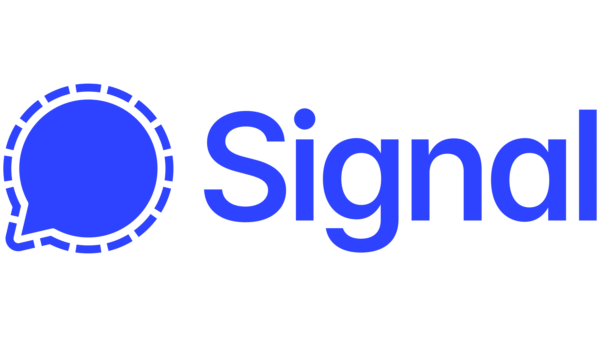
O padrão ouro de mensagens seguras para uso cotidiano.  
Desenvolvido pela **Signal Foundation**, uma organização **sem fins lucrativos**.  
Criptografia ponta a ponta em tudo por padrão: mensagens, chamadas de voz, chamadas de vídeo, grupos.  
O protocolo Signal é tão reconhecido que o próprio WhatsApp o usa para criptografar mensagens (mas depois entrega os metadados).  
> Em resposta a uma intimação judicial em 2022, o Signal só conseguiu entregar duas informações: a data de criação da conta e a data do último acesso. ***Por design, é tudo que existe para entregar.***  
### Prós:

- E2E em tudo, por padrão
- Open-source e amplamente auditado
- Coleta o mínimo absoluto de dados
- Mensagens que se autodestroem
- Sem anúncios, sem rastreamento

### Contras:

- Exige número de telefone para criar conta, ou seja o Signal sabe seu número, mesmo que seus contatos não vejam
- Servidor centralizado (hospedado na Amazon AWS)
- Metadados de quem fala com quem ainda são vulneráveis a análise de tráfego avançada
- Depende de push notifications do Google/Apple no celular

Conclusão:
***Melhor escolha para quem quer privacidade sem abrir mão de usabilidade. Recomendado para uso geral.***


## Session
  
O Signal sem as partes que ainda te identificam.  
O Session nasceu como um fork do Signal, mas evoluiu para algo diferente. A principal diferença: **não precisa de número de telefone**. Você cria uma conta com um **ID aleatório gerado localmente**. **Sem email, sem telefone, sem nenhum dado pessoal.**  
O Session usa um sistema de onion routing próprio sobre uma rede descentralizada de nós, o que reduz a exposição de IP e do gráfico social.  
IVPN Mensagens são roteadas por múltiplos nós antes de chegar ao destino, e deletadas dos nós assim que entregues.  
**Em 2024, o Session migrou formalmente para a Suíça IVPN, uma jurisdição mais favorável à privacidade.**

### Prós:

- Sem número de telefone, sem vínculo com sua identidade real
- Rede descentralizada, sem servidor central
- E2E por padrão
- Open-source e auditado pela Quarkslab
- Mensagens se autodestroem

### Contras:

- Base de usuários menor que Signal
- Interface menos polida
- Sem chamadas de voz/vídeo tão estáveis quanto Signal
- Rede de nós menor, o que pode ser mais lento

Conclusão:
***Melhor que o Signal para quem precisa de anonimato real — sem telefone vinculado, sem servidor central.***


## XMPP (Jabber)
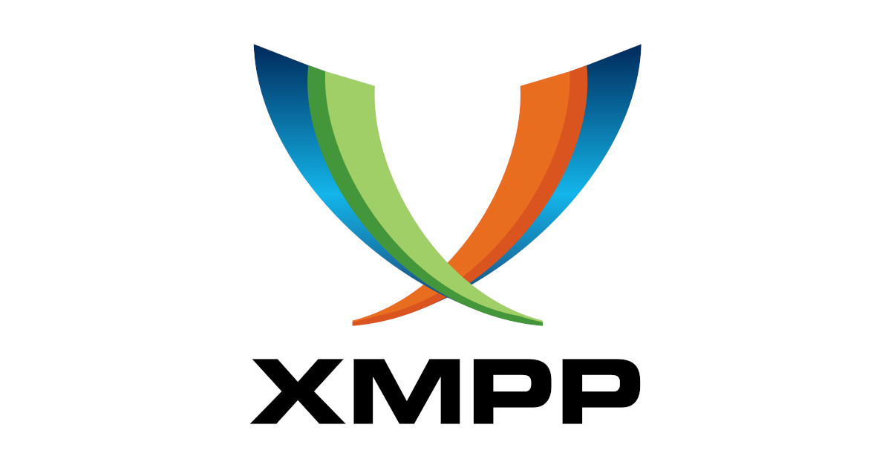  
O veterano da comunicação descentralizada. Existe desde 1999.  
**XMPP não é um app**, ele é um protocolo aberto. Você escolhe um servidor (ou hospeda o seu próprio), escolhe um cliente (app), e se comunica com qualquer pessoa em qualquer servidor XMPP do mundo, igual a um email. Nenhuma empresa controla a rede inteira.  
A criptografia ponta a ponta no XMPP se chama OMEMO, se basea no mesmo algoritmo do Signal, mas implementada de forma diferente.    
O problema é que o OMEMO não é ativado por padrão e pode ser desativado VPN That, o que significa que depende do cliente que você usa e da configuração do servidor. Configurado corretamente, é muito seguro. Configurado errado, é plaintext.  

### Clientes recomendados:

- Conversations (Android), o melhor cliente mobile
- Gajim (Desktop, Windows/Linux)
- Siskin (iOS)
- Pigdin (Tails)

### Para criar conta: [Entre aqui](JoinJabber.org)

### Prós:

- Descentralizado, você pode hospedar seu próprio servidor
- Protocolo aberto com décadas de auditoria
- Nenhuma empresa controla a rede
- Pode rodar em servidor Tor onion para máximo anonimato
- Federado, qualquer servidor XMPP fala com qualquer outro

### Contras:

- OMEMO não é ativado por padrão, depende muito da configuração
- Experiência inconsistente entre clientes
- Mais complexo para iniciantes
- Sem cliente único que funcione bem em todas as plataformas
- Chamadas de vídeo/voz inconsistentes dependendo do cliente

Conclusão:
***Para quem quer controle total e está disposto a configurar. Ideal para quem quer hospedar o próprio servidor.***


## Extras que valem mencionar
Além dos principais, dois apps merecem citação rápida:  

### SimpleX 
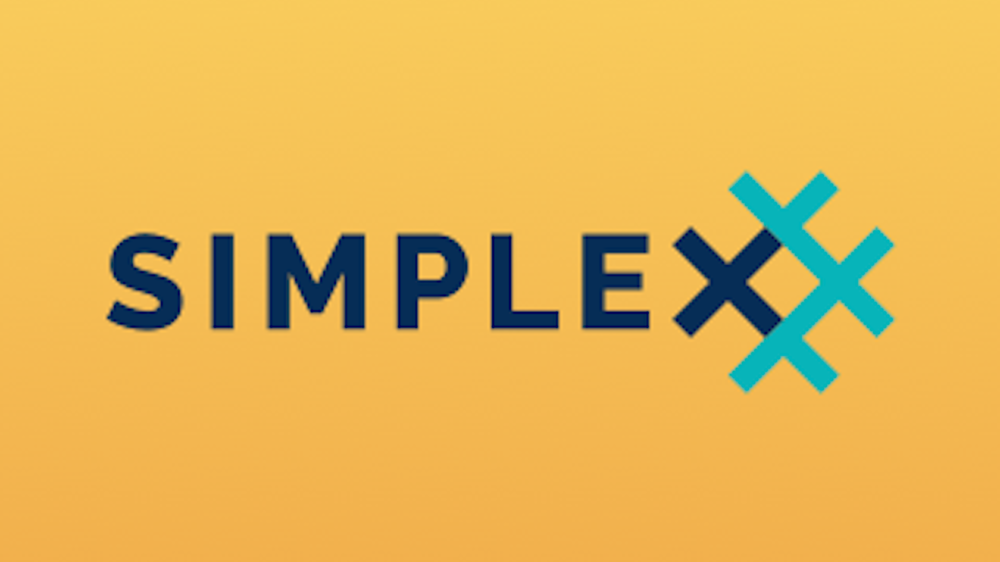
O mais novo e talvez o mais radical em privacidade. Não tem identificador de usuário nenhum, nem número, nem ID, nem chave pública permanente. Você conecta via links ou QR codes. Ainda pequeno, mas auditado e crescendo.  

### Matrix / Element
Protocolo federado como o XMPP, mas mais moderno. O cliente principal é o Element. Suporta chamadas de vídeo, grupos grandes, e integração com outros serviços. Mais fácil que XMPP para iniciantes, mas os metadados de grupos vazam para todos os servidores dos membros.

## Resumo de Chats
| App | E2E por padrão | Precisa de telefone | Servidor | Para quem é |
| --- | -------------- | ------------------- | -------- | ----------- | 
| WhatsApp | Sim (conteúdo)| Sim | Meta (centralizado)| Evite para privacidade |
| Discord | Não | Não | Centralizado | Evite para privacidade | 
| Instagram | Não | Não | Meta (centralizado) | Evite para privacidade| 
| Telegram | Não (só Secret Chat)| Sim | Centralizado | Comunidades públicas| 
| Signal | Sim | Sim | Centralizado | Uso geral |  seguro |  
| Session | Sim | Não | Descentralizado | Anonimato real |
| XMPP+OMEMO | Depende da config | Não | Descentralizado / self-host | Controle total | 
| SimpleX | Sim | Não | Descentralizado | Máxima | privacidade | 


# VPN

Agora você já deve ter visto anúncios de VPN em todo lugar, YouTuber patrocinado, banner no site, oferta relâmpago.  
A maioria dessas propagandas vende a VPN como solução para tudo. **Não é**.  

Mas antes de falar o que VPN não é, vamos entender o que ela é.  

## O que é uma VPN?
VPN significa:  `Virtual Private Network/Rede Privada Virtual`.  
Normalmente quando você acessa um site, o caminho é direto:  
`Você → Internet → Site`  
Com uma VPN, o caminho vira:  
`Você → Servidor VPN (criptografado) → Internet → Site`  

"O que muda então?"

- O site vê o IP do servidor VPN, não o seu  
- Seu provedor de internet (NET, Vivo, Claro, tanto faz) vê que você está conectado a uma VPN, mas não vê o que você está acessando.  
- Sua conexão fica criptografada entre você e o servidor VPN

> Exemplo: você está no Wi-Fi de um café. Sem VPN, qualquer pessoa na mesma rede pode, com as ferramentas certas, ver seu tráfego. Com VPN, tudo que sai do seu dispositivo está criptografado, inútil para quem interceptar.

## O que VPN não faz
Isso é tão importante quanto o que ela faz:

- Não te deixa anônimo por completo, a VPN ainda sabe quem você é
- Não protege seu fingerprint de browser
- Não substitui OPSEC, nada substitui isso
- Não protege contra malware ou vírus
- Não esconde que você está usando uma VPN, seu provedor continua vendo isso

Uma VPN troca a confiança do seu provedor de internet pela confiança da empresa de VPN. **Se a VPN for ruim**, você saiu perdendo.

> se não for super caçado ignore o próximo tópico.
## 5 Olhos, 9 Olhos e 14 Olhos
Antes de falar das VPNs, você precisa entender isso.  
Existem alianças de inteligência entre países onde os governos compartilham dados de vigilância entre si. Se uma VPN está sediada num desses países, o governo local pode exigir que ela entregue dados, e esse dado pode acabar nas mãos de outros governos da aliança.  

### 5 Olhos. os mais integrados, maior risco:

> PAISES: EUA, Reino Unido, Canadá, Austrália, Nova Zelândia

### 9 Olhos. inclui os 5 anteriores mais:

> PAISES: França, Noruega, Dinamarca, Países Baixos


### 14 Olhos. inclui os 9 anteriores mais:

> PAISES: Alemanha, Bélgica, Itália, Suécia, Espanha

> Nota: _Isso não significa que uma VPN nesses países é automaticamente ruim, uma política real de zero logs significa que não há nada para entregar mesmo sob pressão. Mas é um fator que vale considerar._

Mullvad fica na Suécia (14 Olhos). IVPN fica em Gibraltar (fora das alianças). ProtonVPN (olha a proton aqui de novo) fica na Suíça (fora das alianças). E isso importa.

## As VPNs
### VPNs Gratuitas
Vamos começar pelo elefante na cama.  
A regra de ouro da internet se aplica aqui mais do que em qualquer lugar: se o produto é gratuito, **você é o produto.**  
Rodar uma infraestrutura de VPN custa dinheiro, servidores, manutenção, largura de banda. Se você não está pagando, alguém está. E esse alguém quer algo em troca (e nesse ponto acho que você já sabe o que é).  

#### O que VPNs gratuitas costumam fazer:

- Coletar e vender seus dados de navegação para anunciantes
- Injetar anúncios no seu tráfego
- Ter criptografia fraca ou desatualizada
- Não ter kill switch (se a VPN cair, seu IP vaza e você não percebe)
- Vazar DNS, seu provedor ainda vê o que você acessa

#### Contras:

- Seus dados são o produto
- Sem auditoria independente
- Sem kill switch confiável
- Velocidade limitada ou throttled
- Histórico de vazamentos e malware em apps falsos

Conclusão:
***Evite para qualquer coisa séria. Se precisar de algo gratuito e confiável, o ProtonVPN tem plano gratuito com limitações mas sem vender dados.***


### Psiphon
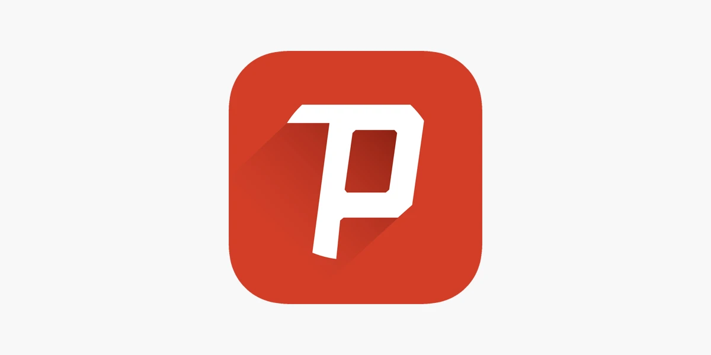  
O Psiphon nasceu como projeto anticensura da Universidade de Toronto, a ideia original era boa: ajudar pessoas em países com censura a acessar a internet livre.  
O problema é que anticensura e privacidade não são a mesma coisa, e o Psiphon nunca pretendeu ser uma VPN de privacidade. **Eles admitem isso abertamente.**

Na prática: coleta dados de conexão, sem kill switch, vazamentos de DNS documentados em testes, e está sediado no Canadá, que faz parte dos 5 Olhos.

#### Prós:

- Funciona bem em países com censura pesada
- Gratuito
- Open-source

#### Contras:

- Coleta IP, tempo de conexão, dados de uso e domínios acessados
- Sem kill switch
- Vazamentos de DNS documentados
- Canada = 5 Olhos
- Velocidade limitada a 2 Mbps no plano gratuito

Conclusão:
***Use apenas para contornar censura pontual. Nunca para privacidade real. (eu mesmo usava para jogar clash royale no trampo)***

### NordVPN
  
Uma das VPNs mais conhecidas do mundo, com marketing agressivo. Por trás do hype, é tecnicamente sólida, mas vem com ressalvas (honeypot da cia).  
**Sediada no Panamá** (fora das alianças de olhos) (mas continua sendo provavelmente da CIA), **política de zero logs** auditada de forma independente pela Deloitte, **servidores RAM-only** (nenhum dado fica gravado fisicamente), mais de 7.000 servidores em 118 países. Em 2018 houve uma invasão em um servidor na Finlândia, a Nord foi transparente, mas o episódio existe.  
O lado negativo não é técnico: é o programa de afiliados agressivo, que faz com que a maioria das recomendações online de NordVPN sejam pagas, não honestas (por isso um pote de mel).

#### Prós:

- Zero logs auditado de forma independente
- Servidores RAM-only
- Rápida (protocolo NordLynx baseado em WireGuard)
- Panamá, fora das alianças
- Funcionalidades extras (bloqueio de malware, multihop)

#### Contras:

- Marketing pesado e afiliados pagos distorcem recomendações
- Histórico de incidente de segurança em 2018
- Limite de 10 dispositivos simultâneos
- Preço

#### Preços e planos: 

- Básico (VPN essencial): A partir de $3,39.
- Plus (VPN + Antimalware + Gerenciador de Senhas): A partir de $3,89.
- Ultimate/Prime (VPN + Seguro contra roubo de identidade): A partir de US$ 7,39/mês.
- Mensal: Aproximadamente R$ 64,90 se pago avulso. 

Conclusão:
***Boa escolha para uso geral. Se privacidade máxima é a prioridade, Mullvad ou IVPN são mais adequados.***


### ProtonVPN
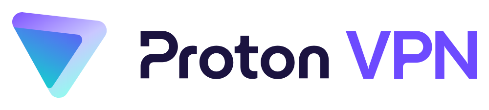
Da mesma empresa do ProtonMail, que você já conhece.  
Sediada na Suíça, fora das alianças de olhos e com leis de privacidade fortes.  

Tem o diferencial de ser a única VPN confiável com plano gratuito sem coleta de dados. O plano gratuito é limitado (poucos servidores, sem multihop), mas é honesto. O código dos apps é open-source e auditado.  

#### Prós:

- Suíça, fora das alianças, leis de privacidade sólidas
- Plano gratuito sem coleta de dados
- Open-source e auditado
- Zero logs verificado
- Integração com o ecossistema Proton (email, drive, etc.)
- Suporte a Tor over VPN

#### Contras:

- Velocidade no plano gratuito é limitada (esperado)
- Mais caro que concorrentes no plano premium
- Já houve caso de entrega de dados (de um usuário de ProtonMail, não VPN), já citado na seção de emails

#### Preços e planos: 
- Free: Dados ilimitados, mas com velocidade média e servidores em apenas 5-10 países.
- VPN Plus: Cerca de US$ 2,99/mês no plano de 2 anos (preço promocional de renovação pode ser maior).
- Proton Unlimited: Aproximadamente US$ 9,99/mês, incluindo VPN, e-mail criptografado, Drive e Agenda

Conclusão:
***Melhor opção para quem já usa o ecossistema Proton. Plano gratuito é a melhor opção sem custo do mercado.***


### Mullvad VPN
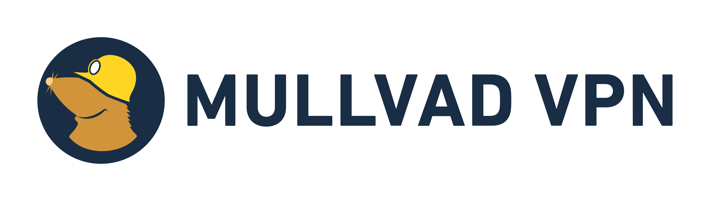
A VPN favorita da comunidade de privacidade. Sem frescura, sem marketing exagerado.  
Sediada na Suécia (14 Olhos, vale notar), mas com uma política de privacidade que vai além de qualquer outra: **não exige email, não exige nome, não exige nada.**  
Você cria uma conta com um número gerado aleatoriamente. Aceita pagamento em dinheiro físico pelo correio e em Monero. **Se não há dados seus, não há nada para entregar.**  
Desenvolveu o Mullvad Browser em parceria com o Tor Project (já citado na seção de [browsers](#browsers)). Auditada regularmente, servidores RAM-only, código open-source.  

#### Prós:

- Zero dados pessoais para criar conta
- Aceita pagamento em dinheiro e Monero
- Open-source e auditado regularmente
- Servidores RAM-only
- Parceria com o Tor Project
- Preço fixo e simples

#### Contras:

- Suécia = 14 Olhos (mitigado pela política de zero dados)
- Sem plano gratuito
- Menos servidores que NordVPN
- Interface menos polida que concorrentes

#### Preços e planos: 
- Plano Único: Valor fixo de € 5,00/mês (aprox. R$30,00, dependendo do câmbio).

Conclusão:
***A melhor opção para quem quer privacidade séria sem abrir mão de usabilidade.***


### IVPN
  
A VPN menos conhecida desta lista, mas uma das mais honestas.  
Sediada em Gibraltar (fora das alianças). Sem afiliados, sem programa de comissão, o que significa que quase ninguém recomenda por dinheiro, e quando recomendam é por mérito.  
Auditoria anual independente pela Cure53 desde 2019, já na sétima edição.   Assim como a Mullvad, não exige email para criar conta.  
O site deles tem algo raro: uma página chamada "você precisa de uma VPN?" onde eles mesmos explicam quando uma VPN não resolve o seu problema.   Transparência incomum no setor.  

#### Prós:

- Gibraltar, fora das alianças
- Auditoria anual independente (sétima edição em 2025)
- Sem afiliados, recomendações são mais honestas
- Zero dados para criar conta
- Transparência acima da média

#### Contras:

- Menos servidores que NordVPN ou ProtonVPN
- Menor comunidade e suporte
- Não funciona bem para streaming
- Menos conhecido = menos testado pela comunidade, logo não se sabe se realmente não entrega ninguém (mas para usuários comuns ponto dispensável)

#### Preços e planos: 

- Standard (2 dispositivos): Aproximadamente **US60,00/ano.
- Pro (7 dispositivos + Port Forwarding + Multi-hop): Aproximadamente **US 100,00/ano.

Conclusão:
***Para quem quer a opção mais honesta e auditada do mercado, mesmo sendo menos popular.***


Resumo
| VPN | Jurisdição | Olhos | Para quem é | Gratuitas |
| --- | ---------- | ----- | ----------- | --------- |
| genéricas | Variada | Variado | Evite | Sim |
| Psiphon | Canadá | 5 Olhos | Só para contornar censura | Sim - $10,00 |
| NordVPN | Panamá | Fora | Uso geral, "confiável" | R$10,00 - R$50,00 |
| ProtonVPN | Suíça | Fora | Ecossistema Proton |  sim - R$60.00 |
| Mullvad | Suécia | 14 Olhos | Privacidade séria | 5 EUR (+/- 30 reais) |
| IVPN | Gibraltar | Fora | Privacidade séria, máxima transparência | $6,00 - $10,00 |

# Mobile

> ***AVISO: Tópico descartável para quem é usuário comum.***

Você configurou tudo no computador. Mas você carrega um rastreador no bolso 24 horas por dia.

Seu celular sabe onde você está, com quem você fala, o que você digita, quando você dorme, quanto você anda, o que você compra. E a maioria das pessoas nunca pensa nisso.

---

## O problema fundamental do celular

O computador você liga quando quer usar. O celular está sempre ligado, sempre conectado, sempre com você.

Isso cria três camadas de problema:

**O hardware:** seu chip de celular (SIM) se registra nas torres da operadora constantemente. Sua operadora (Claro, Tim....) sabe sua localização em tempo real, com quem você liga, por quanto tempo. Isso independe de qualquer app ou SO.

**O sistema operacional:** Android é do Google. iOS é da Apple. Os dois coletam dados por padrão (Infelizmente), telemetria, localização, hábitos de uso, e muito mais.

**Os apps:** cada app instalado é uma potencial janela aberta para sua vida. Câmera, microfone, localização, contatos, tudo vira dado se você não controlar as permissões.

---

## Número Descartável

O número de telefone é um identificador poderoso. Ele está vinculado ao seu CPF na operadora, aparece nos metadados de chamadas e mensagens, e é exigido em praticamente todo cadastro online.

### Números virtuais temporários

Para verificações pontuais — criar uma conta, receber um código SMS, confirmar um cadastro, você não precisa usar seu número real.

Serviços gratuitos de números temporários:
- **[SMSOnline](https://www.smsonline.cloud/pt/country/Brazil)** — números brasileiros temporários, gratuito
- **[MyTempSMS](https://pt.mytempsms.com)** — dezenas de países, gratuito
- **[Receive-SMS](https://receive-smss.com)** — números globais, gratuito

> **Aviso importante:** esses números são públicos, qualquer pessoa pode ver as mensagens recebidas. Nunca use para contas importantes, senhas ou qualquer coisa sensível. São para verificações descartáveis apenas.

### Números virtuais privados

Para uso contínuo com mais privacidade, um segundo número que só você controla:

- **JMP.chat** — número real que funciona via XMPP, pago, sem vínculo com sua identidade se pago com cripto
- **MySudo** — app que gera números virtuais separados por contexto (trabalho, pessoal, anônimo)

### Celular descartável físico

Para casos onde você precisa de um número completamente desvinculado da sua identidade real:

- Compre um celular básico pré-pago **em dinheiro**, numa loja física, sem usar seu CPF na ativação do chip.  
- Chips pré-pagos no Brasil tecnicamente exigem cadastro, mas chips comprados em camelô ou de terceiros frequentemente não têm esse vínculo.

> Já ouvi falar de pessoas que compram chip e cadastram com CPF aleatórios também....

> **Importante:** mesmo um celular descartável deixa rastros se conectado ao mesmo Wi-Fi que seus outros dispositivos, ou se você fizer login em qualquer conta pessoal nele. **O dispositivo precisa ter uma vida completamente separada da sua.**

---

## Desgooglar o Android

Se você não quer trocar de sistema operacional mas quer diminuir a exposição ao Google, existe um caminho intermediário.

O problema do Android padrão são os **Google Play Services**, um pacote de serviços que **roda em segundo plano com permissões elevadas e envia dados para o Google constantemente**. A ideia de "desgooglar" é remover ou substituir esse componente.

**F-Droid** — loja de apps 100% open-source, sem conta Google necessária. A maioria dos apps de privacidade que você já viu nesse guia está aqui.
[f-droid.org](https://f-droid.org)

**Aurora Store** — permite baixar apps da Play Store sem conta Google. Você acessa o catálogo completo de forma anônima.
**[disponível no F-Droid]**

**microG** — substituto open-source dos Google Play Services. Mantém compatibilidade com apps que dependem do Google, mas sem a telemetria. Mais fácil de instalar via ROMs que já vêm com ele, como o CalyxOS.

> Desgooglar um Android padrão sem trocar o SO é possível mas trabalhoso, e dependendo do fabricante pode ser impossível sem root. A solução mais eficaz é instalar um **SO alternativo.**

---

## Sistemas Operacionais Alternativos

### GrapheneOS
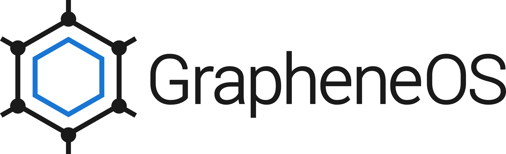  
O GrapheneOS é um sistema operacional móvel focado em privacidade e segurança, com compatibilidade com apps Android, desenvolvido como projeto open-source sem fins lucrativos.

Ele não usa nenhum app ou serviço do Google por padrão, minimizando a exposição de dados a terceiros. O foco é em hardening de segurança com melhorias no sandbox, mitigações de exploits e no modelo de permissões.

O diferencial em relação a outros sistemas é o **sandboxed Google Play** — uma forma de rodar os Play Services dentro de um container isolado, sem privilégios de sistema. Enquanto o Google Play normalmente tem acesso a localização e dados em segundo plano, o sandboxed Play desabilita sugestões de teclado baseadas em input e oculta senhas durante a digitação.

**Prós:**
- O mais hardened de todos, padrão ouro de segurança mobile
- Sem telemetria nenhuma por padrão
- Sandboxed Google Play para compatibilidade sem abrir mão da segurança
- Open-source e auditado
- Atualizações de segurança rápidas

**Contras:**
- Funciona apenas em dispositivos **Google Pixel**(ou seja sem Brasil), sem suporte a outros fabricantes
- Instalação requer conhecimento técnico moderado
- Alguns apps podem não funcionar sem integração completa com o Play
- Interface minimalista, menos amigável para iniciantes

**Dispositivos compatíveis:** Google Pixel 6 em diante  
**Download:** [grapheneos.org](https://grapheneos.org)

> A melhor escolha para quem quer segurança máxima e tem um Pixel. É o padrão recomendado pela comunidade de privacidade.

> Hardening/hardened: Segurança, limitação, Não existe tradução exata mas é esse conceito. 
---

### CalyxOS
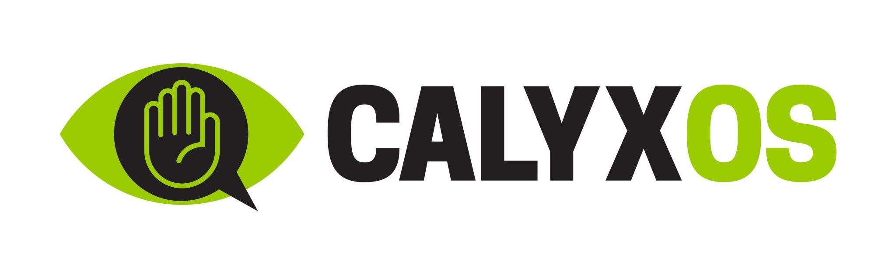  
O CalyxOS era considerado o meio-termo perfeito entre conveniência e privacidade, mais acessível que o GrapheneOS para quem vem do Android padrão.

Mas há um aviso importante e atual: em 2025, o Google publicou apenas o código da plataforma do Android 16, omitindo deliberadamente as árvores de código específicas dos dispositivos Pixel. O CalyxOS não conseguiu se adaptar rápido o suficiente e tomou a decisão de remover as imagens de instalação para todos os dispositivos suportados.

Desde agosto de 2025, o CalyxOS está em hiato.

Isso muda o cenário completamente. O CalyxOS pode voltar pois o projeto não foi encerrado, apenas pausado, mas no momento em que esse guia foi escrito, **não tem imagem de instalação disponível para novos usuários**.

> Se você já usa CalyxOS, ele continua funcionando. Para novos usuários, GrapheneOS é o caminho.

---

### LineageOS
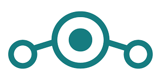  
O ROM mais antigo e mais compatível. Existe desde 2016 e suporta centenas de dispositivos diferentes, incluindo celulares antigos que o fabricante abandonou.

O LineageOS não tem foco específico em privacidade, é mais sobre compatibilidade e longevidade do hardware. Não vem com Google por padrão, mas também não tem o hardening do GrapheneOS.

**Prós:**
- Suporte a centenas de dispositivos
- Ótimo para dar nova vida a celulares antigos
- Open-source e comunidade enorme
- Sem bloatware de fabricante

**Contras:**
- Sem hardening de segurança avançado
- Qualidade varia muito por dispositivo — depende do mantenedor
- Instalação mais complexa que GrapheneOS
- Privacidade depende de configuração manual

**Download:** [lineageos.org](https://lineageos.org)

> Boa opção para reutilizar hardware antigo. Para privacidade real, ainda precisará configurar manualmente.

---

### /e/OS
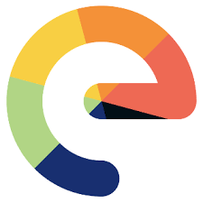  
Uma alternativa menos conhecida mas interessante  
Android completamente desgoogleado com uma interface própria e serviços de nuvem próprios (calendário, contatos, email, armazenamento).

O objetivo é ser um ecossistema completo sem Google ou Apple. Vem com microG, loja de apps própria (App Lounge), e sincronização com servidores da /e/ Foundation que é sediada na França.

**Prós:**
- Ecossistema completo sem Google
- Suporte a vários dispositivos além de Pixel
- Interface familiar, fácil para iniciantes
- Versão paga já vem instalada em hardware selecionado

**Contras:**
- Segurança menos hardened que GrapheneOS
- Os servidores de nuvem próprios são um ponto centralizado de confiança
- Menor comunidade que LineageOS ou GrapheneOS
- França = 14 Olhos

**Download:** [murena.io](https://murena.io)

---

## Resumo

| Solução | Dificuldade | Para quem é |
|---|---|---|
| Número virtual temporário | Nenhuma | Verificações pontuais |
| Desgooglar Android padrão | Média | Quem não quer trocar o SO |
| GrapheneOS | Média | Segurança máxima, Pixel |
| CalyxOS | Média | Em hiato desde ago/2025 |
| LineageOS | Alta | Hardware antigo, uso geral |
| /e/OS | Baixa/Média | Ecossistema completo sem Google |

---

## Dica Final: Hábitos no Celular

Trocar o SO resolve muito, mas hábitos importam:

- Revise permissões de cada app, câmera, microfone e localização não devem ser liberados por padrão para nada.
- Desative Bluetooth e Wi-Fi quando não estiver usando, ambos emitem sinais que podem rastrear sua localização física. 
- Não carregue o celular em portas USB públicas, podem roubar dados via USB (juice jacking)
- Modo avião desativa toda comunicação com torres, incluindo localização por GPS assistido
- Tape a câmera frontal **se paranoia máxima for o objetivo** (e traseira também)

> Dica de desastrado, trinque o vidro das cameras, mas não remova, isso vai dar um imagem borrada e sem foco. OU ARRANCA A CAMÊRA. :3

---


# Gerenciadores de Senha

Você tem OPSEC, sistema seguro, browser privado, VPN, rede anônima. Tudo isso cai por terra se sua senha é `francisco123`.

Mas não é só senha fraca o problema. É **reutilização de senha**.

Se você usa a mesma senha em dez sites diferentes e um deles vazar (e eles vazam, constantemente) todas as suas contas estão comprometidas de uma vez. Isso tem nome: **credential stuffing**, e é um dos ataques mais comuns e eficientes que existem.

A solução é ter senhas únicas, longas e aleatórias para cada conta. O problema óbvio: ninguém memoriza cinquenta senhas diferentes de 20 caracteres. É aí que entra o gerenciador.

## O que é um gerenciador de senhas

Um cofre criptografado que armazena todas as suas senhas. Você memoriza **uma senha mestre** (longa e forte) e o gerenciador cuida do resto. Ele também gera senhas aleatórias para você, preenche formulários automaticamente, e avisa se alguma senha sua apareceu em vazamentos conhecidos.

> A senha mestre é tudo. Se ela for fraca, o cofre inteiro é fraco. Se você esquecê-la, perdeu o acesso. Escolha bem e nunca a escreva em lugar nenhum digital. (papel e caneta)

---

## KeePassXC
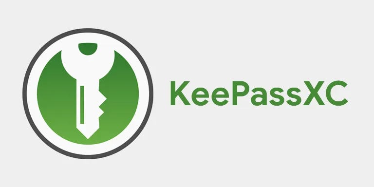  
O gerenciador para quem quer controle total.

O KeePassXC armazena tudo **localmente**, um arquivo `.kdbx` criptografado no seu próprio disco. Nenhuma nuvem, nenhum servidor externo, nenhuma empresa com acesso aos seus dados. Você é o único responsável pelo arquivo.

É open-source, auditado, e existe versão para Windows, Mac e Linux. Tem integração com browser via extensão.

A sincronização entre dispositivos é manual, você decide onde guardar o arquivo (pendrive, Syncthing, Proton Drive, onde quiser). Isso é uma vantagem para quem não confia em nuvem, e uma inconveniência para quem quer praticidade.

**Prós:**
- Armazenamento 100% local, zero dependência de servidor externo
- Open-source e auditado
- Gratuito para sempre
- Funciona offline completamente
- Você controla onde o arquivo fica

**Contras:**
- Sincronização entre dispositivos é manual
- Interface menos polida que concorrentes
- Se perder o arquivo e não tiver backup, perdeu tudo
- Curva de aprendizado maior

**Download:** [keepassxc.org](https://keepassxc.org)

> Recomendado para quem já tem familiaridade técnica e não quer depender de nenhuma empresa.

---

## Bitwarden
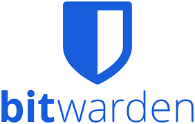
O gerenciador para quem quer equilíbrio entre segurança e praticidade.

O Bitwarden armazena suas senhas em servidores próprios, criptografadas com sua senha mestre, que eles nunca conhecem. É open-source, auditado anualmente, e tem versão gratuita generosa. Funciona em todos os dispositivos automaticamente.

O diferencial em relação a outros gerenciadores em nuvem como LastPass ou 1Password: o código é aberto e auditável, e você pode **hospedar seu próprio servidor** se não quiser depender da infraestrutura deles.

O LastPass, por comparação, teve vazamentos sérios em 2022 onde cofres criptografados dos usuários foram roubados, um lembrete de que gerenciadores em nuvem de código fechado são um ponto único de falha.

**Prós:**
- Sincronização automática entre todos os dispositivos
- Open-source e auditado
- Plano gratuito funcional
- Opção de self-host para controle total
- Interface polida e fácil de usar
- Extensões para todos os browsers principais

**Contras:**
- Dados ficam em servidor externo (mesmo que criptografados)
- Depende de conexão para sincronizar
- A empresa tem acesso aos cofres criptografados, você tem que confiar na implementação deles

**Preços e planos:** 
- Gratuito ($0): Inclui armazenamento ilimitado de senhas em dispositivos ilimitados, sincronização total, gerador de senhas e passkeys.
- Premium ($1,65/mês - $19,80/ano): Adiciona autenticador integrado (TOTP), 5 GB de armazenamento para anexos criptografados, acesso de emergência e relatórios de saúde do cofre.

**Download:** [bitwarden.com](https://bitwarden.com)

> Melhor escolha para a maioria das pessoas. Fácil de usar, confiável, e open-source.

---

## Resumo

| Gerenciador | Armazenamento | Para quem é |
|---|---|---|
| KeePassXC | Local | Controle total, perfil técnico |
| Bitwarden | Nuvem (ou self-host) | Uso geral, praticidade |

---

> **Dica extra:** independente do gerenciador, ative **autenticação de dois fatores (2FA)** em tudo que aceitar. Mesmo que sua senha vaze, sem o segundo fator não entram. O melhor app para isso é o **Aegis** (Android, open-source) ou **Raivo** (iOS).


# Autenticação de Dois Fatores (2FA)

Sua senha vazou. Isso não é hipótese, é estatística. Com o volume de vazamentos que acontecem todo ano, é questão de tempo até algum serviço que você usa expor suas credenciais.

O 2FA existe para que isso não seja o fim do jogo.

## O que é

Autenticação de dois fatores significa que além da senha, você precisa de um **segundo elemento** para entrar na conta. Mesmo que alguém tenha sua senha, sem o segundo fator não entra.

Os três tipos de fator existentes são:

- **Algo que você sabe** — senha, PIN
- **Algo que você tem** — celular, chave física
- **Algo que você é** — biometria, impressão digital

O 2FA combina dois desses. O mais comum é senha + código gerado no celular.

---

## Tipos de 2FA — do pior ao melhor

**SMS — evite sempre que possível**

O código chega por mensagem de texto. Parece conveniente mas é o método mais fraco. Ataques de **SIM swapping**, onde alguém convence sua operadora a transferir seu número para um chip deles, são mais comuns do que parecem, e com isso recebem todos os seus códigos SMS.

Melhor que nada, mas troque para qualquer outra opção assim que puder.

**TOTP — o padrão recomendado**

TOTP significa *Time-based One-Time Password* — um código de 6 dígitos que muda a cada 30 segundos, gerado localmente no seu app. Não depende de internet, não depende da operadora, e cada código só funciona uma vez.

É o método que você vai usar na maioria dos sites. O app gera o código, você digita, acabou.

**Chave física (Hardware Key) — o mais seguro**
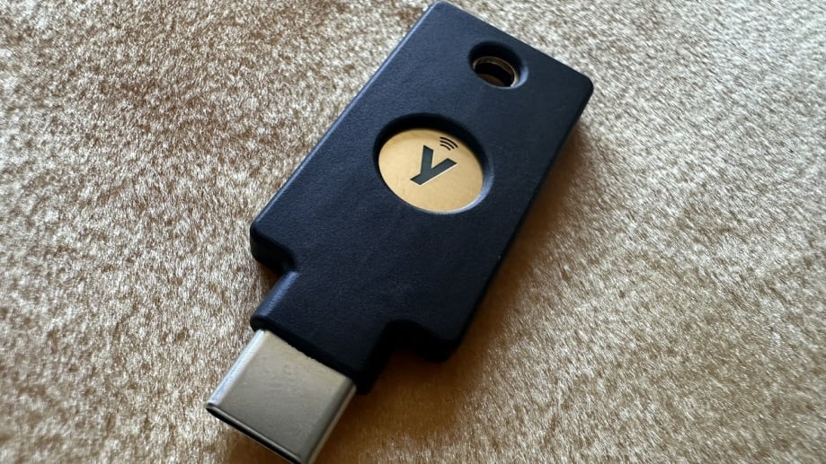
Um dispositivo físico, parecido com um pendrive, que você conecta ou aproxima do computador para autenticar. Impossível de phishing, a chave verifica se o site é legítimo antes de responder. Marcas conhecidas: YubiKey, Nitrokey (open-source).

É o nível mais alto de segurança, mas tem custo e é menos conveniente. Para contas críticas tipo email principal, gerenciador de senhas, vale considerar.

---

## Apps de TOTP

**Aegis** *(Android)*
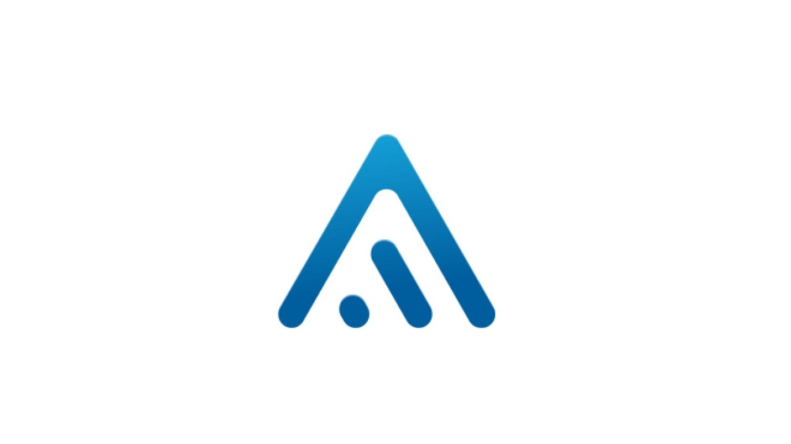
O melhor app de autenticação para Android. Open-source, auditado, permite backup criptografado dos seus códigos, e tem proteção por senha ou biometria para abrir o app. Disponível no F-Droid e Play Store.
[getaegis.app](https://getaegis.app)
___
**Raivo** *(iOS)*
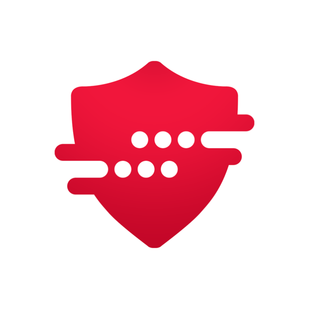
Equivalente do Aegis para iPhone. Open-source, sem sincronização com servidores externos, backup via iCloud criptografado.
[raivo-authenticator.com](https://raivo-authenticator.com)

> **Nunca use o Google Authenticator.** Ele manteve backups dos seus códigos TOTP sem criptografia no Google por anos, só adicionou criptografia em 2024 após pressão da comunidade. Existem alternativas melhores.

---

## Backup dos códigos

Esse é o passo que todo mundo esquece e descobre que esqueceu no pior momento possível.

Quando você ativa 2FA em um site, ele mostra **códigos de recuperação**, guarde eles. Se perder o celular sem backup, esses códigos são o único jeito de recuperar o acesso.

Onde guardar os códigos de recuperação:
- No KeePassXC junto com a senha da conta
- Impresso em papel guardado num lugar seguro
- Nunca em texto puro no celular ou computador

O Aegis permite exportar um backup criptografado de todos os seus TOTPs, faça isso regularmente e guarde em lugar seguro.

> Perder acesso ao 2FA sem backup é perder a conta para sempre na maioria dos serviços. Não tem recuperação.

---

## Resumo

| Método | Segurança | Praticidade | Recomendação |
|---|---|---|---|
| SMS | Fraca | Alta | Evite |
| TOTP (Aegis/Raivo) | Boa | Média | Recomendado |
| Chave física (YubiKey) | Máxima | Baixa | Contas críticas |

---

> **Ordem de prioridade para ativar 2FA:** email principal primeiro — quem controla seu email controla recuperação de todas as outras contas. Depois gerenciador de senhas. Depois todo o resto.

---


# Criptomoedas e Pagamentos Anônimos

Esse tópico apareceu várias vezes ao longo do guia, Mullvad aceita Monero, Tuta aceita Bitcoin, IVPN aceita cripto. Mas nunca foi explicado direito.

A maioria das pessoas acha que criptomoeda é sinônimo de anonimato. **Não é.**

## O problema do Bitcoin
  
Bitcoin é transparente por design. No Bitcoin, qualquer pessoa pode ver quantias, endereços, e timestamps de qualquer transação. Existe um blockchain público onde cada movimentação é registrada para sempre. (Além de que depois de ser minerado todos, acabou motivação para sustentar a rede)

O que o Bitcoin oferece é **pseudonimato**, seu nome não está diretamente vinculado ao endereço, mas com análise suficiente dá para chegar até você. Empresas especializadas em análise de blockchain fazem exatamente isso para governos e exchanges.

Se você comprou Bitcoin numa exchange que pediu seus documentos (KYC), esse Bitcoin está vinculado à sua identidade desde o início. Qualquer transação futura pode ser rastreada de volta a você.

## Monero — o padrão ouro de privacidade
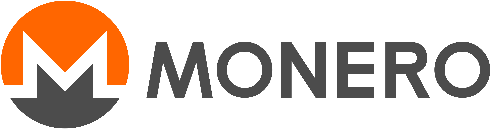
O Monero é a única criptomoeda importante onde todo usuário é anônimo por padrão. O remetente, o destinatário e o valor de cada transação são ocultados através de três tecnologias: Stealth Addresses, Ring Signatures e RingCT.

Como cada uma funciona:

**Ring Signatures** — suas transações se misturam com as de outros usuários, criando um "anel" de decoys. Ninguém consegue identificar quem realmente enviou.

**Stealth Addresses** — a cada transação, um endereço único de uso único é gerado para o destinatário. Isso impede que múltiplas transações sejam vinculadas à mesma carteira.

**RingCT** — oculta o valor transferido. Diferente do Bitcoin onde qualquer pessoa vê quanto foi enviado, no Monero o valor é criptografado.

O resultado: duas transações Monero feitas ao mesmo tempo são indistinguíveis no blockchain, não importa se são salários, doações ou transferências pessoais.

### Ressalvas importantes

O próprio site do Monero deixa claro: se você usa Monero mas dá seu nome e endereço para outra parte, ela não vai magicamente esquecer. Se você compartilha suas chaves secretas, outros saberão o que você fez. Privacidade no protocolo não substitui bom senso.

E tem um problema prático crescente: o maior risco para moedas de privacidade não é a tecnologia, é o acesso às exchanges. Em fevereiro de 2024, a Binance delistou o Monero. O acesso à compra e venda fica mais restrito e dependente de região.

A União Europeia também vai banir moedas de privacidade e contas cripto anônimas a partir de julho de 2027 sob a nova regulação contra lavagem de dinheiro.

**Prós:**
- Privacidade por padrão em todas as transações, não é opcional
- Impossível rastrear remetente, destinatário ou valor
- Open-source e auditado
- Aceito por várias VPNs e serviços de privacidade

**Contras:**
- Sendo delistado em várias exchanges por pressão regulatória
- Transações mais lentas e pesadas que Bitcoin
- Difícil de comprar sem KYC dependendo do país
- Regulação crescente na Europa

**Site oficial:** [getmonero.org](https://getmonero.org)

---

## Bitcoin com privacidade extra

Se precisar usar Bitcoin especificamente, existem técnicas para aumentar a privacidade:

**CoinJoin** — mistura sua transação com as de outros usuários, dificultando rastreamento. Carteiras como **Wasabi** (desktop) implementam isso automaticamente.
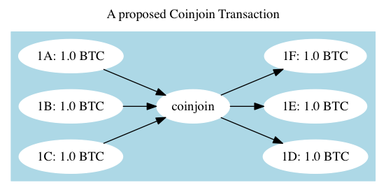

**Lightning Network** — camada de pagamentos em cima do Bitcoin. Transações na Lightning não ficam registradas no blockchain principal, o que dificulta rastreamento.
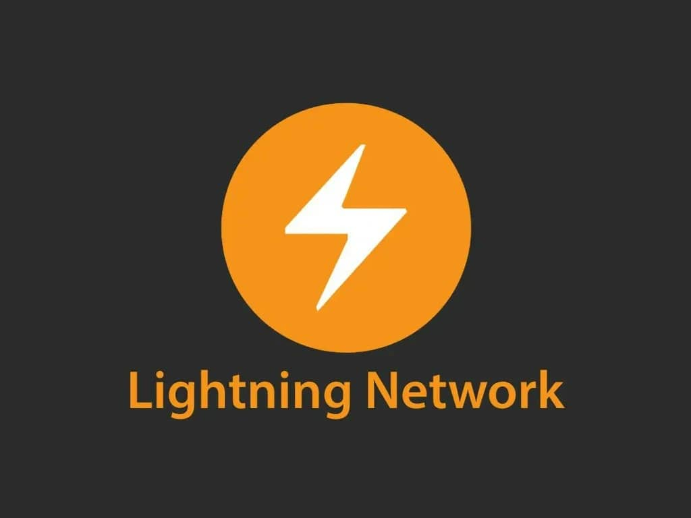

> Mas lembre: se o Bitcoin veio de uma exchange com KYC, o histórico existe independente do que você fizer depois. O ponto mais fraco é sempre a entrada e saída do sistema.

---

> Uma regra que vale para qualquer cripto: **o momento em que ela toca uma exchange com KYC, o anonimato acaba**. A privacidade só existe dentro do ecossistema descentralizado.

---


# continua..